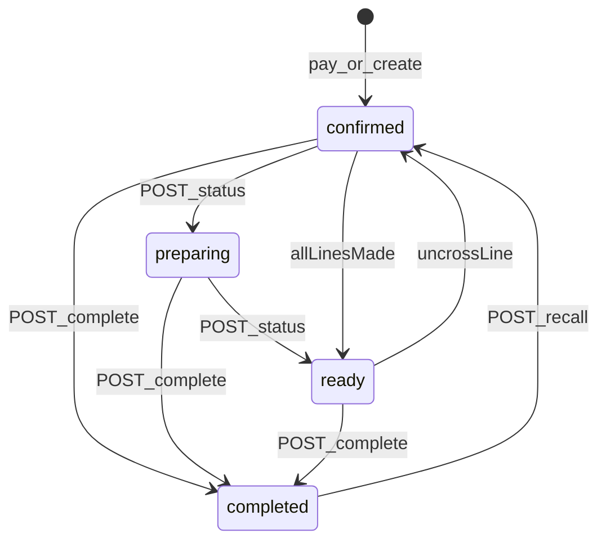

# KDS board contracts (Flow UI shipped)

Socket payloads stay `NormalisedOrder`; the KDS app derives Flow chrome via `deriveFlowLine` (and legacy `deriveLinePrep`). Installability (manifest / Add to Home Screen) is Workstream 6 in [roadmap.md](roadmap.md) — today this is a Vite SPA, not an installed PWA.

## Data on order lines

`order_items` snapshots written at create time:

| Field | Role |
|-------|------|
| `modifiers[].colorHex` | Chip / milk colour |
| `modifiers[].chipLabel` | Short chip text (e.g. `Oa`) |
| `modifiers[].isSize` | Size rows (skipped as chips) |
| `modifiers[].isDefault` | KDS hides default options (Whole milk, Double shot, House bean, …) |
| `category` | Menu category snapshot — category containing `food` → food row |

## Prep derivation

```ts
import { deriveFlowLine, deriveLinePrep } from '@moonshot/types';

const flow = deriveFlowLine(orderItem, kdsConfig);
// flow.isFood, shotLabel, beanAccent, sizeLabel, milk, syrups, notes, allergens

const prep = deriveLinePrep(orderItem, kdsConfig);
// prep.milkColorHex, prep.beanBadgeKey, prep.chips[]
```

Classification roles on `kdsConfig.modifierClassification`:

| Role | Default group names | Flow treatment |
|------|---------------------|----------------|
| `coffeeModifiers` | Milks, Milk | Square milk chips (hidden when default) |
| `additions` | Syrups, Extras | Round syrup chips |
| `shots` | Shots | Bracket label when non-default |
| `beans` | Beans | Bracket label + accent colour when non-default |
| `milkTemperature` | Milk Temperature | Italic before milk name when non-default |
| `milkTexture` | Milk Texture | Italic after milk name when non-default |

Bean bracket accents (`beanBadges.*.accent`): house `#e8a33d`, decaf `#7aa2d6`, guest `#7fb069`.

## Ticket header (derived, not a DB enum)

| Kind | Rule | Shows customer name |
|------|------|---------------------|
| SIT IN | `orderType === 'eat_in'` | No |
| TAKEAWAY | `orderType === 'takeaway'` + `source === 'pos'` | No |
| PICKUP | `orderType === 'takeaway'` + app/web/whatsapp | Yes (when `display.showCustomerNameInHeader`) |

### Hybrid timer

- Deadline: POS/walk-up → `createdAt + 4m`; pickup → `pickup.pickupTime` (fallback +4m).
- Recalled tickets lock `etaMode = manual_override` and `pickupTime = now + 4m` so they get a fresh sit-in/takeaway SLA instead of the original (already-late) clock. FIFO ETA recompute skips them.
- Counts **down** to deadline (green → amber in last 60s), then **up** past-due in red.

## Config endpoint

```
GET /api/v1/kds/config   (KDS JWT)
→ { ok: true, data: { kdsConfig } }
```

Loaded after login by the KDS app. Admin edits layout / timers / display / ETA / audio via settings PATCH.

## Audio cues

Two WebAudio-synthesised cues, configured on `kdsConfig.audio` (not `display`):

| Cue | Trigger | Default |
|-----|---------|---------|
| New order | `kds:order:new` for an order id **not already on the board** | `chime` |
| Overdue | any non-ready ticket goes red; repeats every `overdueRepeatSeconds` (0 = once) | `knock` |

Recall uses the same `kds:order:new` event. The KDS inserts the ticket **optimistically before** the server echo, so the id is already on the board and the chime is skipped. Connection-state-recovery replays are skipped the same way. The initial HTTP snapshot is not a socket event and never chimes. A recall on a **second** device is genuinely new to this board and does chime.

iOS Safari will not play audio without a prior user gesture. Login submit calls `AudioContext.resume()` **before** `await kdsLogin`. A reload restores the session from `sessionStorage` and skips login — the header control is the recovery gesture (`Tap to enable sound`). Device mute lives in `localStorage` (survives reload). Effective audibility is `audio.enabled && !deviceMuted && context ready`. A silent board always shows **Sound off** (or **Tap to enable sound**) in the header.

The overdue alarm is board-level (one tick, not per card) so five red tickets produce one chime. Tickets with `status === 'ready'` or in the dismiss animation are excluded. Timer thresholds in config are not wired into `computeOrderTimer` yet — red still means past the hardcoded 4-minute SLA / pickup time.

## Status machine



| Method | Path | Body |
|--------|------|------|
| `POST` | `/api/v1/kds/orders/:orderId/status` | `{ status: "confirmed" \| "preparing" \| "ready" }` |
| `POST` | `/api/v1/kds/orders/:orderId/complete` | (existing) |
| `POST` | `/api/v1/kds/orders/:orderId/recall` | `{ lineIds?: string[] }` reopen that `completed` ticket → `confirmed` |
| `POST` | `/api/v1/kds/orders/recall-last` | reopen latest `completed` → `confirmed` (API-only; no KDS chrome) |

Flow board interaction:

- Tap a **line** → local strikethrough; when **all** lines made → `POST .../status` `{ status: "ready" }` (demote to `confirmed` if a line is un-crossed).
- Tap the **header** → `POST .../complete` (emits `customerOrderCompleted` for order-ahead).
- Header **Recent orders** → dialog of the last 20 completed tickets. Recall is optimistic: the card lands on the board immediately, the dialog closes, and a failure rolls the ticket back into the dialog. The remake starts a fresh 4-minute walk-up timer (`pickupTime` + `manual_override`); it does not keep the original created/pickup deadline.

Emits:

- `kds:order:updated` (full order) on status advance / demote
- `kds:order:new` on recall
- `customerOrderStatusUpdated` `{ orderId, cafeId, status }`
- `customerOrderCompleted` on Done

## Recall line selection (client-only)

Baristas can untick lines in the Recent orders dialog. Only ticked lines come back un-crossed; the rest seed as already made.

- The KDS sends `lineIds` (the ticked remake set) on `POST .../recall` from day one. The server ignores the field today — durable per-line made-state is a later server change, not a UI rewrite.
- `useKdsOrders` keeps a `recallSelections` map of the **unselected** complement and passes it to `OrderCard` as `initialMadeIds`.
- This map is **ephemeral and single-device**: a reload or a second iPad drops it. Per-line made-state is not persisted; a later durable implementation is a server change.

## Square line identity

POS webhooks upsert `order_items` on `(order_id, pos_line_uid)`. Square's line `uid` is stored as `pos_line_uid`; `order_items.id` (the KDS line key) is preserved across updates so made-state and recall selection survive. App orders use positional `app:${index}` keys at insert.

If Square retrieve fails after three attempts, ingress persists `detailsPending: true` and **does not** wipe existing lines. The KDS card shows **Details pending** until a later webhook fills the snapshot.

## Open-board window

`GET /kds/orders` and `POST /kds/orders/recall-last` only consider rows from the last **16 hours** (`created_at` / `completed_at`). This is a list filter, not auto-cancel — stale open rows keep their status. Specific-id recall and the Recent orders dialog (`LIMIT 20`) are not clock-bounded.

Pending recalls are `isProtected` in `orders-store` so a poll between the optimistic insert and the server response cannot delete the card. The same hook covers dismissing cards (collapse animation).

## ETA stretch

| Method | Path | Body |
|--------|------|------|
| `POST` | `/api/v1/kds/orders/:orderId/eta` | `{ pickupTime: IsoDateTime }` |

Sets `orders.pickup_time` and `orders.eta_mode = 'manual_override'`. FIFO recompute **skips** manual rows. Emits `kds:eta:updated` + `customerEtaUpdated`.

## Flow board layout

- Drinks first; food after a dashed `FOOD` / `FOOD ONLY` divider (food always after drinks regardless of API order).
- Drink row: shot column (qty + bar + name + `[shots · bean]` + size) · milk/syrup column (collapses when empty) · right column allergens (yellow chrome) + free-text notes (plain off-white, right-aligned).
- Food row: qty · italic name · same right column (allergens + notes, `justify-end`).
- Order-level notes: footer strip on the live `OrderCard` (and Recent Orders).

## iPad install (Clay & Bean)

Installable SPA: `public/manifest.json` (`display: standalone`) + Apple meta tags + icons. No service worker.

1. Open the KDS HTTPS URL in **Safari** on the iPad.
2. Share → **Add to Home Screen**.
3. Launch from the **home-screen icon** (not a Safari tab) — URL bar is hidden.
4. Settings → Display & Brightness → **Auto-Lock → Never**, and keep the iPad on power. Screen sleep suspends JS timers and is the largest real-world disconnect source.
5. Optional shift lock: Settings → Accessibility → **Guided Access** → enable; on the KDS icon, triple-click the side/top button and start Guided Access.

Opening the same URL as a Safari tab always shows the address bar — that is expected Safari behaviour, not a missing install config.
