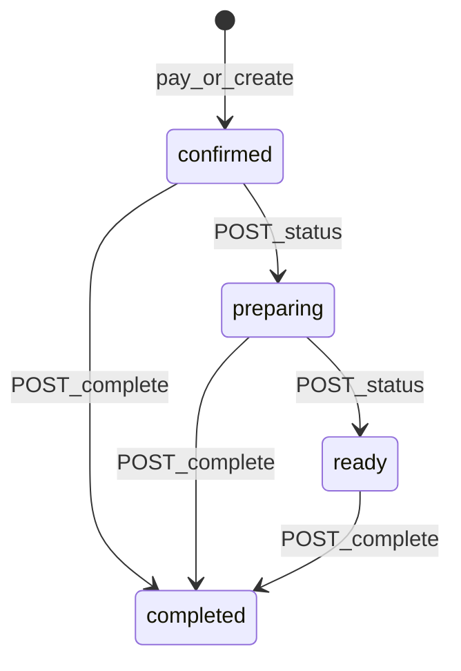

# KDS board contracts (API ready — UI deferred)

Handoff for the separate KDS board UI plan. Socket payloads stay `NormalisedOrder`; the PWA derives prep chrome via `deriveLinePrep`.

## Data on order lines

`order_items.modifiers` JSONB snapshots include KDS chip fields written at create time:

| Field | Role |
|-------|------|
| `colorHex` | Chip / milk line colour |
| `chipLabel` | Short chip text (e.g. `Oa`) |
| `isSize` | Size rows skipped by prep derivation |

These are restored on read in `order-map.ts` `parseModifiers` (M2). Older rows without the fields still parse; chips fall back to option name initials.

## Prep derivation

```ts
import { deriveLinePrep } from '@moonshot/types';

const prep = deriveLinePrep(orderItem, kdsConfig);
// prep.milkColorHex, prep.beanBadgeKey ('house'|'decaf'|'guest'|null), prep.chips[]
```

- **Square chips** — groups listed in `kdsConfig.modifierClassification.coffeeModifiers` (default `Milks`, `Milk`)
- **Round chips** — everything else (syrups/extras/unknown)
- **Milk colour** — option `colorHex`, else `kdsConfig.milkColors` by chip/option key
- **Bean badge** — option/chip name matching house / decaf / guest

## Config endpoint

```
GET /api/v1/kds/config   (KDS JWT)
→ { ok: true, data: { kdsConfig } }
```

Load after login in the UI plan. Admin already edits layout / timers / display / ETA formula via settings PATCH.

## Status machine



| Method | Path | Body |
|--------|------|------|
| `POST` | `/api/v1/kds/orders/:orderId/status` | `{ status: "preparing" \| "ready" }` |
| `POST` | `/api/v1/kds/orders/:orderId/complete` | (existing) |

Emits:

- `kds:order:updated` (full order) on status advance
- `customerOrderStatusUpdated` `{ orderId, cafeId, status }` — order-ahead `useOrderTracking` applies it; 5s poll is the safety net
- `customerOrderCompleted` on Done (unchanged)

## ETA stretch

| Method | Path | Body |
|--------|------|------|
| `POST` | `/api/v1/kds/orders/:orderId/eta` | `{ pickupTime: IsoDateTime }` |

Sets `orders.pickup_time` and `orders.eta_mode = 'manual_override'`. FIFO recompute **skips** manual rows (they still count toward queue depth). Emits `kds:eta:updated` + `customerEtaUpdated`.

## Board UI (out of scope here)

Row layout, chip chrome, allergy border, timers/grouping, ticket advance/ETA controls — owned by the separate KDS UI plan. This doc is the contract that plan should consume.
