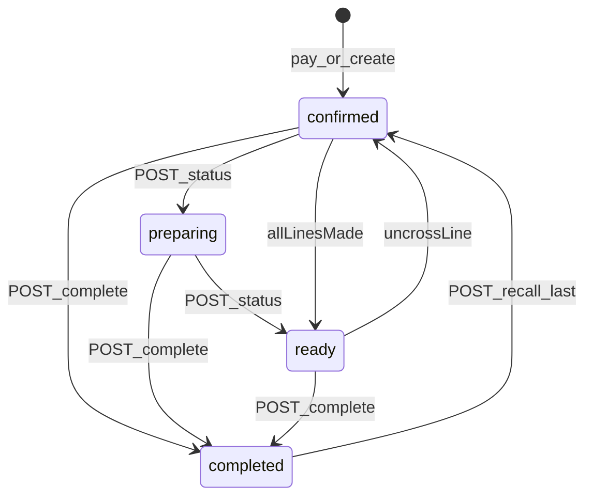

# KDS board contracts (Flow UI shipped)

Socket payloads stay `NormalisedOrder`; the KDS app derives Flow chrome via `deriveFlowLine` (and legacy `deriveLinePrep`). Installability (manifest / Add to Home Screen) is Workstream 6 in [roadmap.md](roadmap.md) — today this is a Vite SPA, not an installed PWA.

## Data on order lines

`order_items` snapshots written at create time:

| Field | Role |
|-------|------|
| `modifiers[].colorHex` | Chip / milk colour |
| `modifiers[].chipLabel` | Short chip text (e.g. `Oa`) |
| `modifiers[].isSize` | Size rows (skipped as chips) |
| `modifiers[].isDefault` | KDS hides default options (Whole milk, Double shot, House bean, …) |
| `category` | Menu category snapshot — category containing `food` → food row |

## Prep derivation

```ts
import { deriveFlowLine, deriveLinePrep } from '@moonshot/types';

const flow = deriveFlowLine(orderItem, kdsConfig);
// flow.isFood, shotLabel, beanAccent, sizeLabel, milk, syrups, notes, allergens

const prep = deriveLinePrep(orderItem, kdsConfig);
// prep.milkColorHex, prep.beanBadgeKey, prep.chips[]
```

Classification roles on `kdsConfig.modifierClassification`:

| Role | Default group names | Flow treatment |
|------|---------------------|----------------|
| `coffeeModifiers` | Milks, Milk | Square milk chips (hidden when default) |
| `additions` | Syrups, Extras | Round syrup chips |
| `shots` | Shots | Bracket label when non-default |
| `beans` | Beans | Bracket label + accent colour when non-default |
| `milkTemperature` | Milk Temperature | Italic before milk name when non-default |
| `milkTexture` | Milk Texture | Italic after milk name when non-default |

Bean bracket accents (`beanBadges.*.accent`): house `#e8a33d`, decaf `#7aa2d6`, guest `#7fb069`.

## Ticket header (derived, not a DB enum)

| Kind | Rule | Shows customer name |
|------|------|---------------------|
| SIT IN | `orderType === 'eat_in'` | No |
| TAKEAWAY | `orderType === 'takeaway'` + `source === 'pos'` | No |
| PICKUP | `orderType === 'takeaway'` + app/web/whatsapp | Yes (when `display.showCustomerNameInHeader`) |

### Hybrid timer

- Deadline: POS/walk-up → `createdAt + 4m`; pickup → `pickup.pickupTime` (fallback +4m).
- Counts **down** to deadline (green → amber in last 60s), then **up** past-due in red.

## Config endpoint

```
GET /api/v1/kds/config   (KDS JWT)
→ { ok: true, data: { kdsConfig } }
```

Loaded after login by the KDS app. Admin edits layout / timers / display / ETA via settings PATCH.

## Status machine



| Method | Path | Body |
|--------|------|------|
| `POST` | `/api/v1/kds/orders/:orderId/status` | `{ status: "confirmed" \| "preparing" \| "ready" }` |
| `POST` | `/api/v1/kds/orders/:orderId/complete` | (existing) |
| `POST` | `/api/v1/kds/orders/recall-last` | reopen latest `completed` → `confirmed` |

Flow board interaction:

- Tap a **line** → local strikethrough; when **all** lines made → `POST .../status` `{ status: "ready" }` (demote to `confirmed` if a line is un-crossed).
- Tap the **header** → `POST .../complete` (emits `customerOrderCompleted` for order-ahead).
- Top-bar **Recall** → `POST .../recall-last` (emits `kds:order:new` + `customerOrderStatusUpdated`).

Emits:

- `kds:order:updated` (full order) on status advance / demote
- `kds:order:new` on recall-last
- `customerOrderStatusUpdated` `{ orderId, cafeId, status }`
- `customerOrderCompleted` on Done
## ETA stretch

| Method | Path | Body |
|--------|------|------|
| `POST` | `/api/v1/kds/orders/:orderId/eta` | `{ pickupTime: IsoDateTime }` |

Sets `orders.pickup_time` and `orders.eta_mode = 'manual_override'`. FIFO recompute **skips** manual rows. Emits `kds:eta:updated` + `customerEtaUpdated`.

## Flow board layout

- Drinks first; food after a dashed `FOOD` / `FOOD ONLY` divider (food always after drinks regardless of API order).
- Drink row: shot column (qty + bar + name + `[shots · bean]` + size) · milk/syrup column (collapses when empty) · notes/allergens.
- Food row: qty · italic name · wide notes/allergens.
