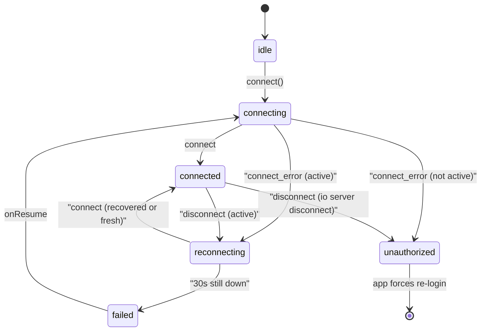

# Realtime architecture (Socket.io)

The API attaches Socket.io to the same Node **HTTP server** as Express.

Two namespaces isolate audiences and middleware:

| Namespace | Client apps | Purpose |
|-----------|-------------|---------|
| **`/kds`** | moonshot-kds | Café-scoped KDS JWT in **handshake** `auth.token`. Auto-joins `kds:cafe:{cafeId}`. Events on channel `kds:event` (`KdsServerToClientEvent`). |
| **`/customer`** | moonshot-order-ahead | **No auth on connect.** Emit `customer:subscribe` / `customer:unsubscribe` (order) or `customer:subscribeCafe` (menu). Events on channel `customer:event`. |
| **`/admin`** | moonshot-admin | Admin JWT in handshake `auth.token` (`purpose: 'admin'`). Auto-joins `admin:cafe:{cafeId}`. Events on channel `admin:event` (`AdminServerToClientEvent`). |

Constants: [`KDS_SOCKET_NAMESPACE`](../../packages/domain/src/dataflow.ts), [`CUSTOMER_SOCKET_NAMESPACE`](../../packages/domain/src/dataflow.ts), [`ADMIN_SOCKET_NAMESPACE`](../../packages/domain/src/dataflow.ts).

Clients share [`RealtimeConnection`](../../packages/web-runtime/src/realtime/connection.ts) in `@moonshot/web-runtime` (React helpers on `@moonshot/web-runtime/react`). `forceNew` is always on so two consumers of the same namespace do not share a Manager socket.

**Scaling:** Socket.io uses the in-memory `SessionAwareAdapter` (required for connection state recovery). That adapter is **per process**. The classic `@socket.io/redis-adapter` does **not** support recovery — multi-instance needs a Redis Streams adapter (or equivalent) plus shared debounce state for catalog sync. A Railway redeploy drops in-memory sessions; clients reconnect unrecovered and HTTP-refetch.

## Connection lifecycle

| Status | Meaning |
|--------|---------|
| `idle` | No socket (logged out / no interest) |
| `connecting` | First handshake |
| `connected` | Live; `socket.recovered` says whether missed packets were replayed |
| `reconnecting` | Transport drop; Socket.IO is retrying |
| `failed` | Still retrying, but down long enough to show "Offline — retrying" |
| `unauthorized` | Handshake rejected (`socket.active === false`) — do not retry the same token |

Wake: `visibilitychange` (visible), `pageshow`, and `online` call `socket.connect()` immediately (bypass backoff) then `onResume` so the app HTTP-reconciles.

Auth is a **callback**, invoked on every handshake including recovery, so a rotated JWT is sent without tearing the socket down.

### Server options

Defined in [`socket-server-options.ts`](../../apps/moonshot-api/src/realtime/socket-server-options.ts). Engine.IO-level, so they apply to `/kds`, `/customer`, and `/admin`.

| Option | Value | Why |
|--------|-------|-----|
| `pingInterval` | 20s | Slightly tighter than the 25s default |
| `pingTimeout` | 40s | Survives a mobile/tablet timer stall. Failure mode is a sleeping iPad, not a dead peer. Worst-case ghost detection ≈ 60s |
| `connectionStateRecovery.maxDisconnectionDuration` | 2 min | Replay missed `kds:event` / `customer:event` / `admin:event` packets after a brief drop |
| `connectionStateRecovery.skipMiddlewares` | **false** | Re-verify the JWT on recovery. The Socket.IO default (`true`) skips auth ([socketio/socket.io#5491](https://github.com/socketio/socket.io/issues/5491)) |

On `socket.recovered === true`, clients skip the HTTP board/menu refetch (packets were replayed) and skip re-emitting `customer:subscribe` (rooms restored). A failed recovery is a normal connect: refetch / re-subscribe.

KDS UI holds `connected` for 8s after a drop (`useGracedStatus`) so a one-second blip never paints a chip or shifts the board. Fallback HTTP poll is 90s while connected, 10s while not.

`MenuProvider` still opens its **own** `/customer` connection for `customer:subscribeCafe`. Both connections now use `RealtimeConnection`; merging them onto `CustomerEventsProvider` is a follow-up — do not add a third `/customer` socket.

## KDS authentication

- **Never** use the default `/` namespace for KDS (reserved for future use); connect to `{API_ORIGIN}/kds`.
- Token is the same JWT returned by `POST /api/v1/kds/auth/login`; claims include `purpose: 'kds'`.
- The app does **not** emit `kds:subscribe`; auth is handshake-only (`KdsSocketHandshakeAuth` in `@moonshot/types`).

## Customer order tracking

### Shared subscription provider (order-ahead)

`CustomerEventsProvider` owns **one** `/customer` Socket.io connection for order-room consumers:

| Consumer | Role |
|----------|------|
| **`ActiveOrdersProvider`** | Registers each active order id; drops completed orders on Home / Profile |
| **`useOrderTracking`** | Registers the detail-page order (guest `trackingToken` or session JWT); ack drives missed-event HTTP catch-up |
| **`LoyaltyProvider`** | Listens only (no room registration of its own); patches the stamp card from `customerOrderCompleted.loyalty` |

Room membership is **refcounted**: two consumers for the same `orderId` share one `customer:subscribe`; the last release emits `customer:unsubscribe`. Leaving a room is unauthenticated — the socket can only leave rooms it already joined.

`MenuProvider` still opens its **own** connection for `customer:subscribeCafe` (public, slug-scoped). Migrating it onto the shared provider is a follow-up; do not add a fourth independent `/customer` socket elsewhere.

| Surface | Push | HTTP fallback |
|---------|------|---------------|
| **Order detail** (`useOrderTracking`) | shared bus → order room | 5s poll while active |
| **Home / Profile lists** (`ActiveOrdersProvider`) | shared bus → each active order id | 30s poll |
| **Stamp card** (`LoyaltyProvider`) | shared bus → `loyalty` on complete | `GET /loyalty/me` when payload absent |
| **Review nudge** (`ReviewNudgeProvider`) | shared bus → `customerReviewEligible` (before complete); refresh on complete | `/auth/me` `reviewPromptState === 'eligible'` |

Subscribing requires **one** of:

1. **Guest** — `authToken` is a **`trackingToken`** JWT from `POST /api/v1/orders` (`purpose: 'track_order'`, short TTL ~48h, scoped to `orderId` + `cafeId`). Only valid while `orders.user_id` IS NULL for that row.
2. **Signed-in** — `authToken` is the **Google/session JWT** from `POST /api/v1/auth/google`. Must match `orders.user_id` for the subscribed order.

The raw order UUID alone is **not** sufficient — this avoids unauthenticated listens if an id leaks.

`NormalisedOrder.editToken` serves other flows (e.g. merge); it is distinct from **`trackingToken`**.

## Server-side emissions

| Trigger | Audience | Event |
|---------|----------|-------|
| Pay-in-store `POST /orders` committed | `/kds` | `kds:order:new` |
| Stripe `checkout.session.completed` (paid) | `/kds` | `kds:order:new` |
| `POST /kds/orders/:id/complete` | `/kds` | `kds:order:removed` |
| `POST /kds/orders/recall-last` | `/kds` | `kds:order:new` |
| `POST /kds/orders/:id/status` | `/kds` | `kds:order:updated` |
| Same status route | `/customer` room `customer:order:{id}` | `customerOrderStatusUpdated` |
| Queue/ETA recompute (FIFO; skips `manual_override`) | `/kds` | `kds:eta:updated` |
| Same ETA recompute / barista stretch | `/customer` room `customer:order:{id}` | `customerEtaUpdated` |
| Same complete route (after loyalty apply, ≤2s budget) | `/customer` room `customer:order:{id}` | `customerOrderCompleted` (optional `loyalty` snapshot) |
| Review threshold (inside loyalty apply, **before** complete) | `/customer` room `customer:order:{id}` | `customerReviewEligible` (`reviewUrl`) |
| Square catalog sync success | `/admin` room `admin:cafe:{id}` | `admin:menu:synced` |
| Same catalog sync | `/customer` room `customer:cafe:{id}` | `customerMenuUpdated` |
| Pause / hours / buffer / date-override writes | `/customer` room `customer:cafe:{id}` | `customerCafeUpdated` |

## Admin menu sync

Admin JWT handshake only (mirrors KDS). After `runCatalogSyncForCafe` succeeds (webhook debounce, Sync now, or cron), emit `admin:menu:synced`. The Admin Menu manager soft-reloads; a 60s status reconcile remains as a safety net (no 10s poll).

## Customer menu invalidation

`MenuProvider` emits `customer:subscribeCafe` with the café slug (public — same as unauthenticated `GET /menu`). On `customerMenuUpdated` it refetches with `cache: 'no-store'` to bypass the 5-minute `Cache-Control` on `GET /menu`.

`CafeProvider` uses the same subscribe. On `customerCafeUpdated` it refetches `GET /cafe/:slug` (`Cache-Control: private, no-store`) so pause and last-order buffer show without a full reload. `POST /orders` remains the hard gate.
