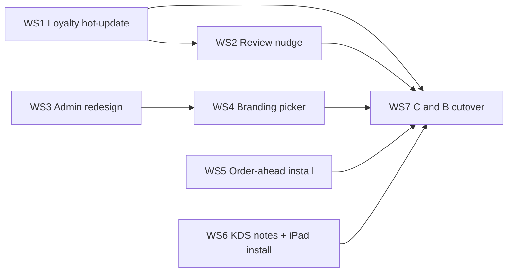

# Moonshot v2 roadmap (Clay & Bean launch)

_Last rewritten: August 2026. Replaces the stale M1–M5 milestone board._

## Definition of Done for launch

Clay & Bean v2 is "released" when:

1. A customer can browse → customise → pay (Stripe) or pay-in-store → track → collect, with no dead ends or state loss on the critical path.
2. The KDS Flow board shows live orders and drives the order lifecycle reliably; completing an order updates the customer app (including the loyalty stamp card) every time.
3. C&B is connected to Square via OAuth (not hand-wired), its menu imported, and orders/webhooks flow with no duplicates.
4. Loyalty stamps accrue correctly; the review nudge is live (single CTA to a café-configured URL — no rating gate).
5. Order-ahead and KDS are installable to the home screen (standalone, no URL bar on tablet).
6. v0.1 is retired and C&B is running solely on v2.

**Already shipped** (do not re-open as launch work): happy-path order flow, Stripe Connect checkout, Square OAuth + catalog sync + token refresh cron, KDS Flow board iteration 1, preparing/ready status + ETA stretch, loyalty ledger, order-ahead theme packs (read path), self-service onboarding. See [progress.md](../progress.md) and [bugs/m1-triage.md](../bugs/m1-triage.md).

Work through the seven workstreams below as separate planned sessions, in order.

---

## Workstream 1 — Loyalty hot-update on order complete

### Current state (verified)

- On KDS complete, the API runs `applyLoyaltyAfterKdsComplete` **after** emitting `customerOrderCompleted`. The event payload has no stamp fields.
- `ActiveOrdersProvider` listens for that event and optimistically drops the order from the active list.
- `LoyaltyProvider` has **no** socket subscription and **no** polling; Home only calls `refreshLoyalty()` on `location.pathname` change.
- Result: the active-order card flips immediately; the stamp card stays stale until the next navigation/refresh.
- A separate `customerLoyaltyUpdated` event emitted *after* the ledger write would race the client: dropping the order changes `idsKey` in `useActiveOrderSockets`, which disconnects the socket before the second event arrives.

### Work

1. Reorder `notifyOrderCompleted` so loyalty apply runs **before** `customerOrderCompleted` is emitted.
2. Return `{ cardProgress, rewardsAvailable }` (and `stampsPerReward`) from `applyLoyaltyAfterKdsComplete` — `applyLedgerStampAndRewards` already returns `cardProgress` and discards it today.
3. Extend the `customerOrderCompleted` socket variant with optional `loyalty?: { stamps; stampsPerReward; rewardsAvailable }`.
4. Preserve swallow semantics: a loyalty failure must never block telling the customer the order is done — emit without `loyalty` on failure.
5. Add `applyLoyaltyFromSocket()` on `LoyaltyProvider`; thread the payload through `useActiveOrderSockets` / `ActiveOrdersProvider`.
6. Fallback: optimistic `stamps + 1` when `loyalty` is absent, reconciled via `GET /loyalty/me`.

### Done when

Completing an order on the KDS while sitting on Home moves the stamp card immediately (no refresh). A forced loyalty failure still flips the order card.

### Files

- `apps/moonshot-api/src/lib/orders/order-lifecycle-notify.ts`
- `apps/moonshot-api/src/lib/loyalty-after-kds-complete.ts`
- `apps/moonshot-api/src/lib/loyalty/apply-ledger-on-complete.ts`
- `packages/types/src/sockets.ts`
- `apps/moonshot-order-ahead/src/providers/LoyaltyProvider.tsx`
- `apps/moonshot-order-ahead/src/hooks/useActiveOrderSockets.ts`
- `apps/moonshot-order-ahead/src/providers/ActiveOrdersProvider.tsx`

---

## Workstream 2 — Review nudge (single CTA)

See also [feedback-prompt-flow.md](../feedback-prompt-flow.md) (narrowed to this design).

### Current state (verified)

- Phase A API is shipped: on the 3rd on-time app order, the API may emit `customerReviewEligible`.
- **Latent bug:** at emit time the API sets `review_prompt_state = 'shown_positive'` before any UI exists. Users who hit the threshold before the modal ships are permanently excluded.
- Order-ahead does **not** listen for `customerReviewEligible`.
- Admin cannot configure review nudge — `AdminFeaturesPatch` only allows `loyalty` and `order_ahead`.
- Config today is `features.review_nudge.{ enabled, googlePlaceId }`. No `feedback_responses` table.

### Work

1. Introduce `review_prompt_state = 'eligible'` at emit time; only move to a terminal state (`shown` / `dismissed`) when the client confirms. Backfill rows that were prematurely set to `shown_positive`.
2. Replace `googlePlaceId` with `reviewUrl` (arbitrary café-configured URL). Keep reading `googlePlaceId` for migration if needed.
3. Extend `AdminFeaturesPatch` + admin settings merge to accept `review_nudge` (`enabled`, `reviewUrl`); surface in Admin UI.
4. Order-ahead modal on order-complete / Order Detail: single “Rate us” CTA opening `reviewUrl`. Drive from **both** the socket event and `/auth/me` membership (`reviewPromptState`), so a user who was on Home at completion still sees it next visit.
5. `POST /feedback/review-prompt` records the terminal state only — no sentiment capture, no mailto path, no `feedback_responses` table. A single CTA shown to everyone is inherently free of rating-gating.

### Done when

After three on-time completed app orders, every eligible user sees the modal once (socket or next visit), the CTA opens the Admin-configured URL, and dismissing/clicking marks the prompt as shown permanently.

### Files

- `apps/moonshot-api/src/lib/loyalty-after-kds-complete.ts`
- `packages/types/src/cafe.ts` (`ReviewNudgeFeatureConfig`)
- `packages/types/src/admin-settings.ts`
- `packages/types/src/sockets.ts`
- `apps/moonshot-api/src/lib/admin/admin-settings-merge.ts`
- `apps/moonshot-order-ahead/src/pages/OrderDetail.tsx` (and/or OrderConfirmed)
- Admin settings card for review nudge
- New feedback route (terminal-state only)

---

## Workstream 3 — Admin dashboard redesign

### Current state (verified)

- MUI v6 + Emotion, ~5.8k lines across 45 files. No Tailwind/shadcn.
- Two clashing themes: polished dark/lime `signupTheme` (BrandShell) vs a minimal light `dashboardTheme` (one primary colour, grey AppBar).
- Post-onboarding is a single scrolling `DashboardPage` of stacked Paper cards — no sidebar, no nested routes.
- No shared `components/ui/` primitives; styling is per-page `sx`.
- `admin-api.ts` is already a **53-line barrel** re-exporting `lib/adminApi/*` (old roadmap claim of an oversized monolith is stale). Oversized targets now: `MenuItemsPanel.tsx` (~530 lines), `adminApi/menu.ts` (~361).

### Work

1. Extend `brandPalette` in `adminTheme.ts` into a full `dashboardTheme` so signup and dashboard share one visual language.
2. Add shared primitives (`PageHeader`, `SettingsCard`, `FormRow`, `SectionNav`) to kill the repeated Paper + Typography + save-button pattern.
3. Replace the single-scroll dashboard with persistent sidebar nav and real sub-routes: Overview, Menu, Branding, Hours, Payments, KDS, Access.
4. Split oversized menu panels / API modules as they are touched (file-size guardrail).

### Done when

An owner can navigate the admin console via clear sections with consistent hierarchy and brand chrome; settings cards no longer each reinvent layout.

### Files

- `apps/moonshot-admin/src/theme/adminTheme.ts`
- `apps/moonshot-admin/src/App.tsx`
- `apps/moonshot-admin/src/pages/DashboardPage.tsx`
- New `apps/moonshot-admin/src/components/ui/*`
- `apps/moonshot-admin/src/components/menu/MenuItemsPanel.tsx`
- `apps/moonshot-admin/src/lib/adminApi/menu.ts`

---

## Workstream 4 — Café branding and theme picker

### Current state (verified)

- Read path is complete: `cafes.theme_id` + `cafes.theme_overrides` ship via `GET /cafe/:slug`; order-ahead `getTheme(themeId, themeOverrides)` deep-merges packs.
- Five packs: `heritage`, `botanical`, `minimal`, `bold`, `classic`.
- **No admin write path** — settings PATCH never updates `theme_id` / `theme_overrides`.
- **No logo field** anywhere; order-ahead has no logo render slot. Menu image upload (S3 + media proxy) is the reuse pattern.

### Work

1. Add `themeId` / `themeOverrides` to `AdminSettingsPatchBody` and the cafés UPDATE. Validate `BaseThemeId` and hex colours (manual validation — this endpoint is not zod).
2. Admin Branding page (depends on Workstream 3 shell): pack picker + colour overrides into `themeOverrides.colors.*`. Fonts already overridable via `themeOverrides.typography.webfontUrls`.
3. Logo: `cafes.logo_url` column, new object-key allowlist pattern, admin upload route, Home hero render slot. Reuse menu-image S3 / resize / proxy pipeline.
4. Keep `theme-contract.test.ts` invariant: no brand hex outside pack files.

### Done when

A café owner can pick a pack, override brand colours, upload a logo, and see the change live on order-ahead without a deploy.

### Files

- `packages/types/src/admin-settings.ts`, `packages/types/src/cafe.ts`
- `apps/moonshot-api/src/lib/admin/admin-settings-merge.ts` (+ settings service UPDATE)
- `apps/moonshot-api/src/lib/menu/menu-image-object-key.ts`
- Admin Branding page
- `apps/moonshot-order-ahead/src/themes/*`, Home / PageHeader logo slot
- New migration for `cafes.logo_url`

---

## Workstream 5 — Order-ahead installability

### Current state (verified)

- `public/manifest.json` exists but is a stub: no `icons` array, no service worker, no `vite-plugin-pwa`, no `apple-touch-icon`, no `theme-color` meta in HTML.
- Android install prompt needs a service worker; iOS Add-to-Home-Screen needs Apple meta tags.
- Deployed via `vite preview` on Railway; `/runtime-config.js` is written at container start.

### Work

1. Add `vite-plugin-pwa` to order-ahead Vite 5.4 config.
2. Generate 192/512 icons (incl. maskable), `apple-touch-icon`, and Apple / theme-color meta tags.
3. Keep `display: standalone` so the URL bar is hidden once installed.
4. Ensure the service worker does **not** cache `/runtime-config.js` stale (config is rewritten at container start).

### Done when

A customer can Add to Home Screen on iOS and Android and launch fullscreen without a browser chrome URL bar.

### Files

- `apps/moonshot-order-ahead/vite.config.ts`
- `apps/moonshot-order-ahead/public/manifest.json`
- `apps/moonshot-order-ahead/index.html`
- Icon assets under `apps/moonshot-order-ahead/public/`

---

## Workstream 6 — KDS notes + iPad install

### Current state (verified)

**Notes**

- Square line-level `note` **is** mapped (`lineItems[].note` → `NormalisedOrderItem.notes`) and rendered italic on drink/food rows.
- Order-level `order.note` → `orders.notes` is stored but **`OrderCard` never renders it** — only `RecentOrdersDialog` does. POS order-level notes never reach the barista on the live board.
- No test asserts `order.note` / `lineItems[].note` in `squareOrderToSnapshot`; fixtures use `notes: null`.
- Failed `fetchSquareOrder` falls back to `notes: null, items: []`, silently dropping data.
- Empty-string notes are stored then hidden by `.trim()` — normalise to `null` at ingress.

**Install**

- KDS has no manifest, icons, or service worker. Docs historically called it a “PWA shell”; it is a Vite SPA.
- Target device is **iPad**. A `display: standalone` manifest + Apple meta tags + Add to Home Screen removes the URL bar. Pair with Guided Access for shift lockdown.
- **Parked:** Capacitor / native wrapper — Apple Developer + provisioning churn for the same visual result on iPadOS.

### Work

1. Render order-level notes on the live `OrderCard` (and keep Recent Orders).
2. Add Square normaliser tests for order- and line-level notes; normalise empty strings to `null` at ingress.
3. Soften failed-fetch fallback logging so silent empty tickets are visible in ops.
4. Add KDS web manifest + icons + Apple meta tags (`display: standalone`). Document Guided Access for C&B iPads. No native wrapper for launch.

### Done when

A Square order with free-text notes (order and/or line) shows them on the live board; KDS Add-to-Home-Screen on iPad runs fullscreen without a URL bar.

### Files

- `apps/moonshot-kds/src/board/OrderCard.tsx`
- `apps/moonshot-api/src/lib/pos-adapters/square/order-normalise.ts` (+ tests)
- `apps/moonshot-api/src/lib/orders/pos-order-ingress.ts`
- `apps/moonshot-kds/index.html`, new `public/manifest.json`, icons

---

## Workstream 7 — C&B cutover and go-live

Ops checklist (low build cost). Do after Workstreams 1–6 are green enough for a real shift.

- [ ] Disable legacy / hand-wired Square token and any per-location webhook; C&B runs OAuth-only.
- [ ] Confirm no duplicate order events after cutover.
- [ ] Confirm Square **production** webhook signature verification is live.
- [ ] Rate-limit public register / abuse surfaces; review KDS JWT lifetime.
- [ ] Barista test on the real C&B iPad during a real service.
- [ ] Decommission v0.1; C&B on v2 only.

### Done when

C&B is on v2 only with OAuth Square, no duplicate POS events, and one clean live shift with no showstoppers.

---

## Post-launch (parked — do not pull into launch)

| Item | Notes |
|------|--------|
| Lightspeed (K-Series) adapter | Gated on partner access |
| Embedded Stripe Elements + Apple/Google Pay | Faster checkout |
| Stripe refunds | Paid cancel currently sets `refundPending` only |
| Redis Socket.io adapter | Required before multi-instance API |
| KDS hold / `layout.columns` grouping / synced line made-state | Board polish beyond iteration 1 |
| KDS audio alerts; offline (SW + IndexedDB) | After installable shell |
| Admin invites, audit trail, orders/analytics views | Beyond branding shell |
| Profile prefs; pickup reschedule | Order-ahead niceties |
| Capacitor / native KDS wrapper | Only if standalone PWA + Guided Access prove insufficient |
| Menu engineering report tool | Separate opt-in product |

---

## Verified corrections (old docs were wrong)

| Claim | Reality |
|-------|---------|
| M1 happy-path cards still open on the old board | Closed — see [bugs/m1-triage.md](../bugs/m1-triage.md) |
| Split oversized `admin-api.ts` | Already a barrel; bulk lives in `adminApi/menu.ts` + menu panels |
| KDS is a “PWA shell” | Vite SPA with no manifest / SW / icons — installability is Workstream 6 |
| Café theme editor is only “post-launch polish” | Read path shipped; write path is launch Workstream 4 |
| Review nudge needs thumbs up/down + `feedback_responses` | Launch scope is single CTA to configurable URL (Workstream 2) |
| Square line notes untested / possibly unmapped | Line notes **are** mapped and rendered; **order-level** notes are the live-board gap |

---

## Cross-app dependencies

- Loyalty stamp payload on `customerOrderCompleted` (WS1) should land before relying on Home-during-complete for the review modal (WS2).
- Branding admin UI (WS4) sits on the redesigned shell (WS3).
- Cutover (WS7) waits on product workstreams being good enough for a live shift.
