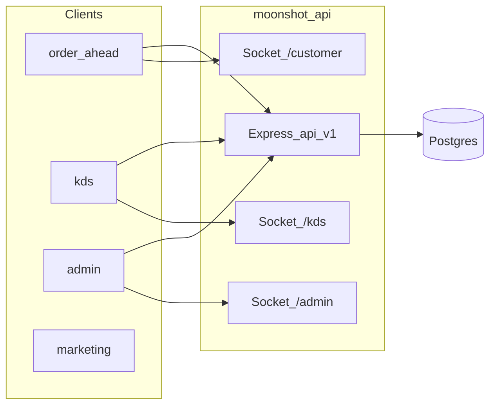
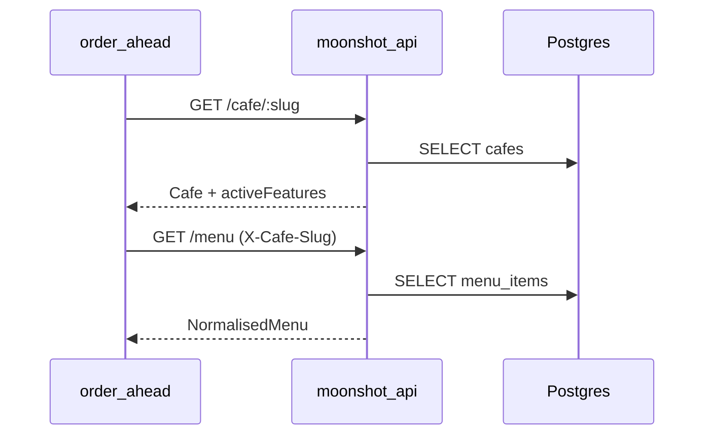
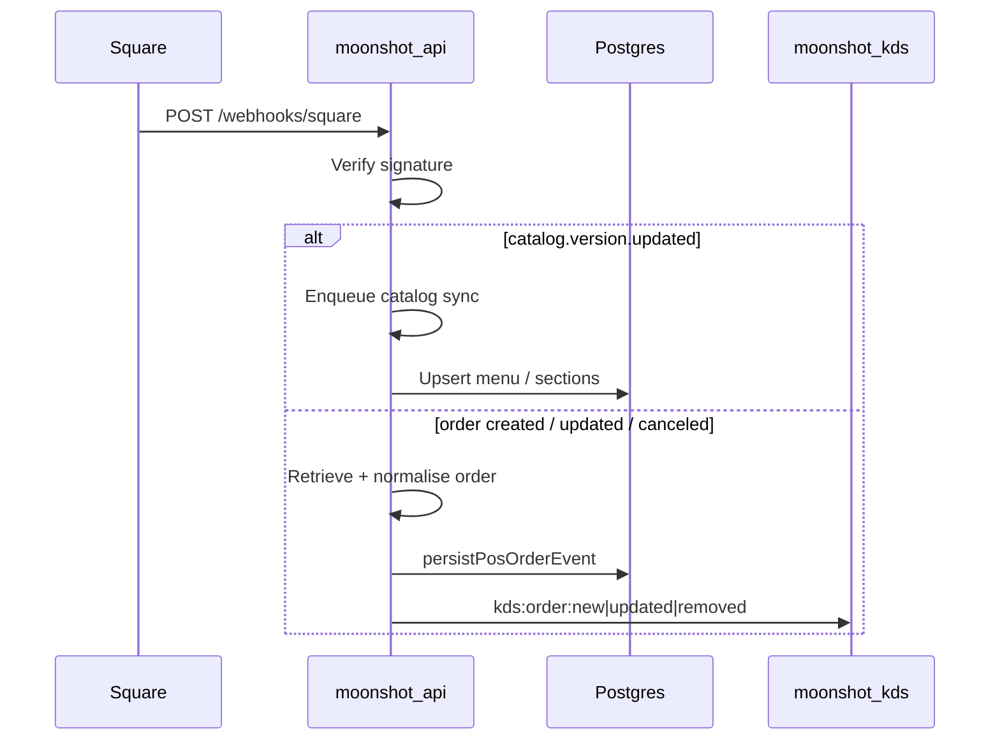

# Current flows

Authoritative summary of **shipped** vs **planned** runtime behaviour. Paths use `/api/v1`.

## Topology

## Shipped

### Thin happy path

1. **Order-ahead** loads café + menu (`GET /cafe/:slug`, `GET /menu`). Optional Google sign-in (`POST /auth/google`, `GET /auth/me`).
2. **Place order:** `POST /orders` with basket. Guests get **`trackingToken`** when `JWT_SECRET` is set and `user_id` is null. Signed-in calls may send **`Authorization`** to attach **`orders.user_id`**.
3. **KDS:** device login → `GET /kds/orders` + Socket namespace **`/kds`** (`kds:order:new` / `kds:order:removed`). Flow board UI (Tailwind/shadcn). KDS users via **admin onboarding** or bootstrap CLI. Recent orders + recall reopen completed tickets.
4. **Customer tracking:** order-ahead opens **`/customer`**, emits `customer:subscribe`; KDS completion emits **`customerOrderCompleted`**. Loyalty + ETA recompute run after `completed`; failures are swallowed so KDS **Done** never 500s after the row is complete.
5. **Admin:** self-service signup + onboarding wizard, settings, menu (sections / archetypes / images), Stripe Connect, Square OAuth + catalog sync. Menu sync also notifies **`/admin`** sockets.
6. **Stripe return:** `/:cafeSlug/checkout/restore?checkout_session_id=…` → `GET /orders/checkout-session/:sessionId` — see [stripe-checkout-return.md](../stripe-checkout-return.md).

### Stripe vs pay-in-store

| Mode | Initial DB status | KDS sees order when |
|------|-------------------|---------------------|
| `pay_in_store` | `confirmed` / `unpaid` | Immediately on `POST /orders` |
| `stripe` | `pending` / `unpaid` | After webhook **or** checkout return recovery confirms `paid` / `confirmed` |

Home **`GET /orders/me`** includes **`pending`** in active orders; KDS open queue does **not**.

### Order status stepper (v1)

Kitchen statuses **`preparing` / `ready`** are API-supported; the order-ahead UI uses a four-chip stepper. Practical v1: poll **`GET /orders/:id`** (~15s) and treat non-terminal as queue-bound until **`customerOrderCompleted`**.

### Café + menu (S0)

### Google auth (S1)

`POST /auth/google` → verify Google ID token → upsert `users` + `cafe_users` → JWT. `GET /auth/me` hydrates membership.

### Pay-in-store order (S2a)

`POST /orders` → resolve modifiers/prices → insert **`confirmed` / `unpaid`** → emit **`kds:order:new`** → recompute FIFO ETA (floored by `requested_pickup_not_before`).

### Stripe Checkout (S2b)

`POST /orders` → insert **`pending` / `unpaid`** → Stripe Checkout session → persist `payment_sessions`. Confirmation: webhook `checkout.session.completed` **or** browser recovery — both call the same `confirmOrderPaidFromStripeCheckout` helper (idempotent). Then KDS + ETA.

### Square POS ingress (orders + catalog)

Square is a first-class ingress path alongside app checkout.

Also: Admin OAuth connect → optional onboarding import / **`POST /admin/menu/sync-pos`**; cron **`POST /internal/pos/refresh-tokens`** and **`…/sync-catalogs`**. See [square-oauth.md](../square-oauth.md) and [pos-normalisation.md](../pos-normalisation.md).

### KDS complete → customer + loyalty

`POST /kds/orders/:id/complete` → mark completed → emit KDS removed + customer completed → loyalty ledger (idempotent) → optional `customerReviewEligible` after 3 on-time app orders.

`POST /kds/orders/:id/status` `{ status: preparing|ready }` → emit `kds:order:updated` + `customerOrderStatusUpdated`.

`POST /kds/orders/:id/eta` `{ pickupTime }` → `eta_mode=manual_override`; FIFO skips those rows; emit ETA sockets.

`GET /kds/orders/recent` → recently completed tickets; `POST /kds/orders/:id/recall` (or `…/recall-last`) reopens as `confirmed` and re-emits to the board.

`GET /kds/config` → café `kdsConfig` for the Flow board (milk/bean accents, classification, timers).

Auth details — [architecture/realtime.md](../architecture/realtime.md). Flow board — [architecture/kds-board.md](../architecture/kds-board.md).

## Planned

- Stripe incremental checkout / order merge (F3) and refunds on cancel
- Feedback HTTP API + order-ahead review drawer (Phase B) — [feedback-prompt-flow.md](../feedback-prompt-flow.md)
- KDS hold, synced line made-state, layout.columns grouping — [architecture/kds-board.md](../architecture/kds-board.md)
- Additional POS providers (Lightspeed, etc.) beyond Square + manual — [pos-normalisation.md](../pos-normalisation.md)
