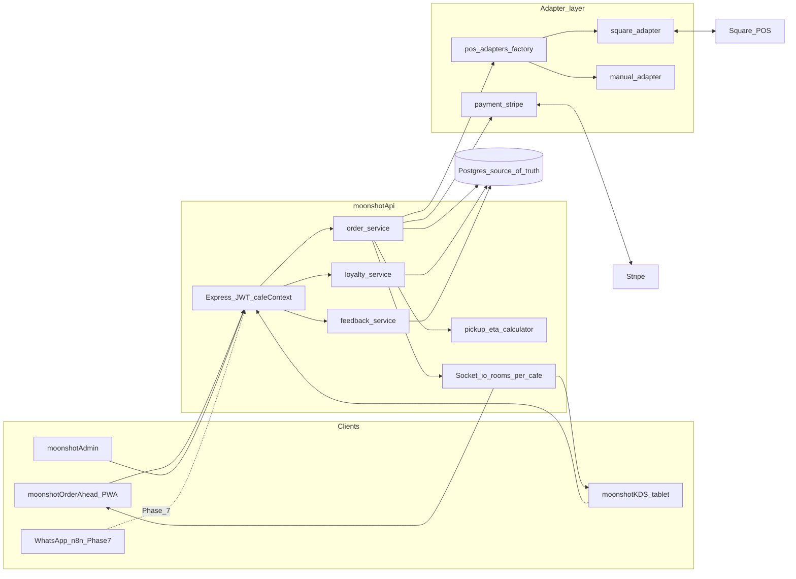

# High-level dataflow

Zappuccino v2 treats **Postgres as the single source of truth** for orders that appear on the KDS and in the customer app. POS systems (Square first, others later) are integrated through a **POS adapter layer** that normalises catalogue and order events into internal shapes. Payment (Stripe) is similarly abstracted.

This replaces the v0.1 pattern where the KDS merged live Square `SearchOrders` results with web-app rows at read time (`mergeKdsBoardOrdersWithWebAppDb`). In v2, every visible order row exists in Postgres first; adapters only ingest and reconcile external IDs.

## Topology

## Request path (HTTP)

1. **Cafe resolution** — subdomain, `Host`, or `X-Cafe-Id` resolves to `cafes` row (multi-tenant from day one).
2. **Auth** — customer JWT for order-ahead; KDS may use device/session token; admin uses owner role (future).
3. **Handlers** — routes delegate to services; services read/write Postgres and enqueue socket emissions.

## Real-time path (Socket.io)

- Clients join a room keyed by `cafe_id` (e.g. `cafe:{uuid}:kds`, `cafe:{uuid}:customer`).
- Server emits **granular** events (`kds:order:new`, `kds:order:updated`, `kds:order:removed`, `kds:eta:updated`, `customerOrderCompleted`, etc.) so clients avoid full-board refetches.
- Emissions happen **after** a successful DB transaction so reconnects can hydrate from REST.

## Ingest paths (orders into Postgres)

| Source            | Ingress                                      | Dedup key                          |
| ----------------- | -------------------------------------------- | ---------------------------------- |
| POS walk-in       | Webhook + optional polling fallback          | `(cafe_id, pos_order_id)`          |
| Order-ahead app   | `POST/PATCH /orders` + Stripe webhooks       | internal `orders.id` + Stripe ids |
| WhatsApp (later)  | `POST /orders` with API key, `source=whatsapp` | idempotency key + `cafe_id`        |

## Pickup ETA (v1)

Automatic: when queue membership or item counts change, `pickup_eta_calculator` recomputes `pickup_time` / `quoted_pickup_time` for affected orders (see [dataflow-sequences.md](dataflow-sequences.md) S5). Barista manual overrides are a later extension; types reserve `etaMode: manual_override`.

## Related docs

- [dataflow-sequences.md](dataflow-sequences.md) — sequence diagrams per critical path.
- [schema-draft.md](schema-draft.md) — tables and indexes.
- [feedback-prompt-flow.md](feedback-prompt-flow.md) — post-completion review prompt.
