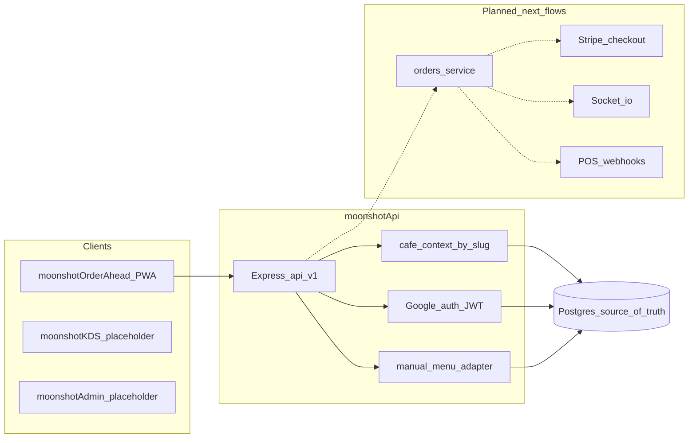

# High-level dataflow

Moonshot is currently in an early Phase 1 state. The deployed monorepo has four Railway services, one per app:

- `apps/moonshot-api` — Express API backed by Postgres.
- `apps/moonshot-order-ahead` — Vite/React/MUI customer app.
- `apps/moonshot-kds` — Vite/React placeholder shell.
- `apps/moonshot-admin` — Vite/React/MUI placeholder shell.

The API currently implements café lookup, Google auth, session hydration, and manual menu reads/admin writes. Postgres is already the source of truth for café, user, membership, and menu data. Orders, Stripe checkout, live KDS sockets, POS webhooks, pickup ETA, loyalty, and feedback are still planned flows represented by contracts/docs rather than runtime code.

## Topology

```mermaid
flowchart LR
  subgraph clients [Clients]
    OA[moonshotOrderAhead_PWA]
    KDS[moonshotKDS_placeholder]
    Admin[moonshotAdmin_placeholder]
  end

  subgraph api [moonshotApi]
    Gateway[Express_api_v1]
    CafeContext[cafe_context_by_slug]
    Auth[Google_auth_JWT]
    Menu[manual_menu_adapter]
  end

  subgraph planned [Planned_next_flows]
    Orders[orders_service]
    Stripe[Stripe_checkout]
    Sockets[Socket_io]
    PosWebhooks[POS_webhooks]
  end

  DB[("Postgres_source_of_truth")]

  OA --> Gateway
  Gateway --> CafeContext
  Gateway --> Auth
  Gateway --> Menu
  CafeContext --> DB
  Auth --> DB
  Menu --> DB
  Gateway -.-> Orders
  Orders -.-> Stripe
  Orders -.-> Sockets
  Orders -.-> PosWebhooks
```

## Current HTTP surface

- `GET /` — API service metadata.
- `GET /health` and `GET /api/v1/health` — health checks.
- `GET /api/v1/cafe/:slug` — public café config and active feature flags.
- `POST /api/v1/auth/google` — verifies a Google credential, upserts `users` and `cafe_users`, then returns a JWT.
- `GET /api/v1/auth/me` — JWT-protected session hydration with café membership data.
- `GET /api/v1/menu` and `GET /api/v1/menu/:category` — public manual menu reads.
- `POST /api/v1/menu`, `PATCH /api/v1/menu/:itemId`, `DELETE /api/v1/menu/:itemId` — menu admin writes for JWT users whose email is listed in `MENU_ADMIN_EMAILS`.

All versioned API routes use `API_VERSION_PREFIX` from `@moonshot/types`, currently `/api/v1`.

## Current café resolution

The API resolves café context from:

- `:slug` on routes that include a path slug, such as `/api/v1/cafe/:slug`.
- `X-Cafe-Slug` on other café-scoped routes, such as `/api/v1/menu`.

Subdomain, `Host`, and `X-Cafe-Id` resolution are not implemented yet.

## App status

- Order-ahead has routes for `/`, `/menu`, and `/profile`. It fetches café and menu data from the API and supports Google sign-in/session hydration.
- KDS is a placeholder React shell with shared socket types imported for compile-time coverage only. No socket client or API integration is wired yet.
- Admin is a placeholder MUI shell. Menu CRUD exists in the API but is not yet exposed through the admin UI.

## Local and Railway environment

API env vars:

- `PORT`
- `DATABASE_URL`
- `JWT_SECRET`
- `GOOGLE_CLIENT_ID`
- `MENU_ADMIN_EMAILS`

Order-ahead env vars:

- `VITE_API_URL` — API origin only, for example `http://localhost:3000` or the public Railway API service URL. Do not include `/api/v1`.
- `VITE_CAFE_SLUG` — defaults in code to `clay-and-bean`.
- `VITE_GOOGLE_CLIENT_ID`

Each Railway app is a separate service with its root directory set to the app folder. The order-ahead service must point `VITE_API_URL` at the public API service URL, not at its own container URL.

## Planned dataflow direction

The intended v2 architecture still treats Postgres as the single source of truth for orders visible in KDS and customer apps. POS adapters, Stripe payment, order ingestion, live sockets, pickup ETA, loyalty, and review feedback should be added around that invariant. See [dataflow-sequences.md](dataflow-sequences.md) for current-vs-planned sequence details.

## Related docs

- [dataflow-sequences.md](dataflow-sequences.md) — sequence diagrams per critical path.
- [schema-draft.md](schema-draft.md) — migrated Phase 1 schema plus planned schema.
- [feedback-prompt-flow.md](feedback-prompt-flow.md) — future post-completion review prompt.
