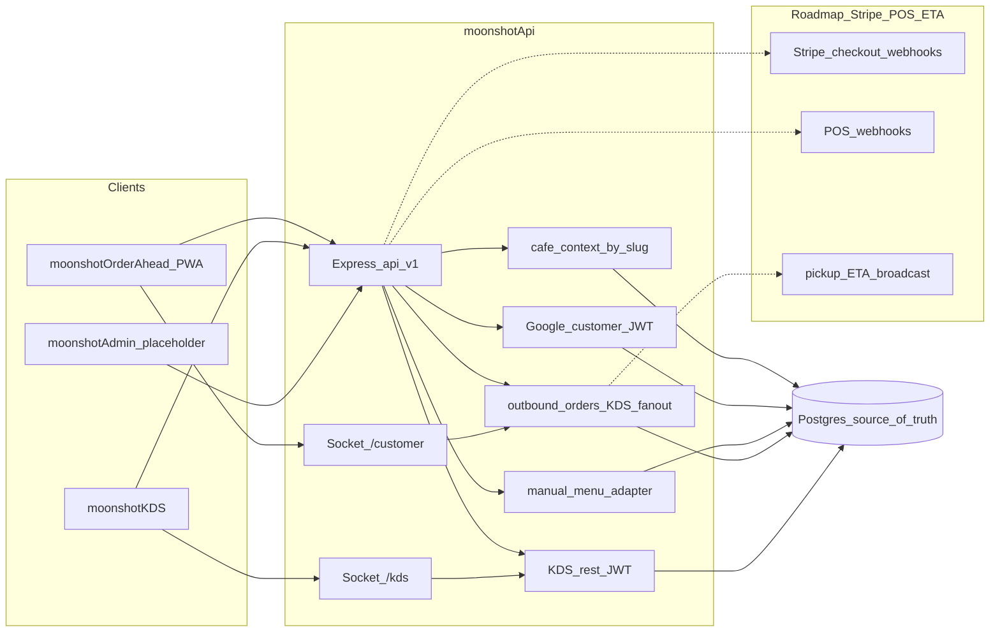

# High-level dataflow

The monorepo ships **four Railway services** (production): API, order-ahead customer PWA, kitchen **KDS**, and **admin** (placeholder UI). Postgres is the canonical store for cafes, users, menu, and orders.

Implementations today include **café + menu reads**, **Google customer auth**, **guest or signed-in pay-in-store orders**, **KDS login + open/complete APIs**, **Socket.io** on namespaces **`/kds`** and **`/customer`**, and **CORS allowlists** via **`CORS_ORIGINS`**. Planned: Stripe checkout, POS webhooks, pickup ETA automation, loyalty surfaces. See [docs/README.md](README.md), [current/http-surface.md](current/http-surface.md), and [architecture/realtime.md](architecture/realtime.md).

## Topology

```mermaid
flowchart LR
  subgraph clients [Clients]
    OA[moonshotOrderAhead_PWA]
    KDS[moonshotKDS]
    Admin[moonshotAdmin_placeholder]
  end

  subgraph api [moonshotApi]
    Gateway[Express_api_v1]
    CafeContext[cafe_context_by_slug]
    Auth[Google_customer_JWT]
    Menu[manual_menu_adapter]
    Orders[outbound_orders_KDS_fanout]
    KdsRoutes[KDS_rest_JWT]
    IoKds["Socket_/kds"]
    IoCust["Socket_/customer"]
  end

  subgraph plannedFlows [Roadmap_Stripe_POS_ETA]
    Stripe[Stripe_checkout_webhooks]
    PosWebhooks[POS_webhooks]
    EtaPickup[pickup_ETA_broadcast]
  end

  DB[("Postgres_source_of_truth")]

  OA --> Gateway
  KDS --> Gateway
  KDS --> IoKds
  OA --> IoCust
  Admin --> Gateway

  Gateway --> CafeContext
  Gateway --> Auth
  Gateway --> Menu
  Gateway --> Orders
  Gateway --> KdsRoutes
  CafeContext --> DB
  Auth --> DB
  Menu --> DB
  Orders --> DB
  KdsRoutes --> DB
  IoKds --> KdsRoutes
  IoCust --> Orders

  Gateway -.-> Stripe
  Gateway -.-> PosWebhooks
  Orders -.-> EtaPickup
```

## Current HTTP surface

Listed concisely at [docs/current/http-surface.md](current/http-surface.md).

## Café resolution

- Path slug **`/api/v1/cafe/:slug`**
- Header **`X-Cafe-Slug`** on other café-scoped routes

Subdomain / `Host` resolution is **not** implemented yet.

## App status

- **Order-ahead:** Café + menu fetch, optional Google JWT, **`POST /orders`** with **`trackingToken`** for guests when signed-out; realtime completion via **`/customer`** Socket.
- **KDS:** Username/password **`POST /kds/auth/login`**, **`GET /kds/orders`**, complete route, realtime **`io('{API_ORIGIN}/kds')`** with JWT handshake.
- **Admin:** Shell only; APIs exist elsewhere.

See [architecture/realtime.md](architecture/realtime.md), [progress.md](progress.md), [roadmap.md](roadmap.md).

## Related docs

- [Current HTTP + CORS](current/http-surface.md)
- [Sequences](dataflow-sequences.md) — detailed implemented vs roadmap flows
- [Schema phases](schema-draft.md)
- [Feedback UX](feedback-prompt-flow.md)
