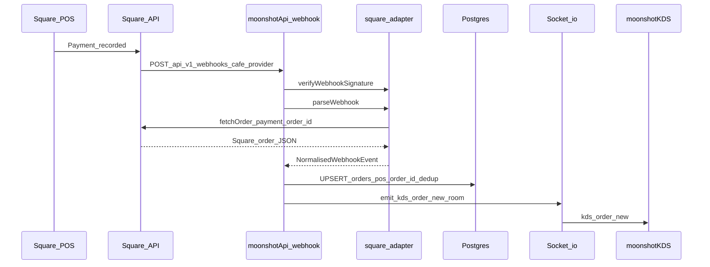
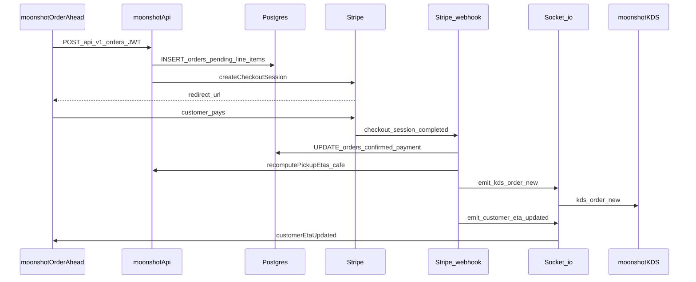
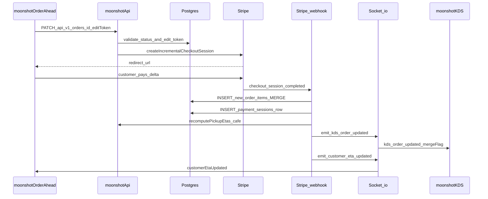
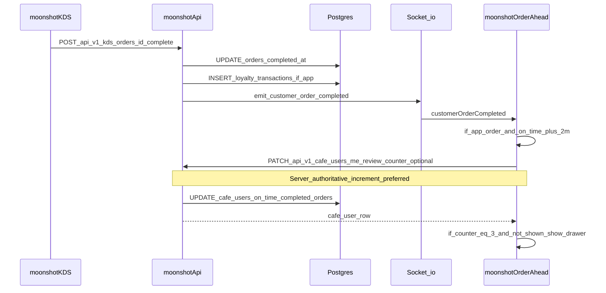
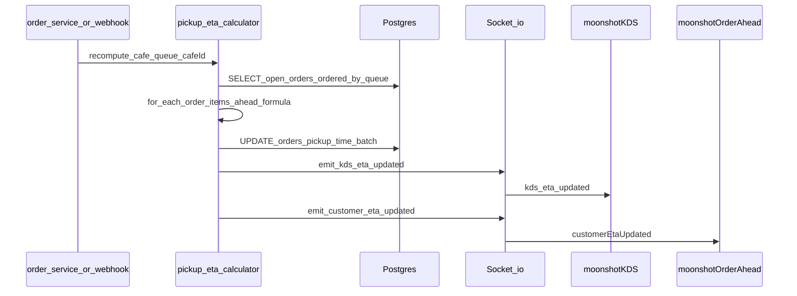

# Mid-level sequence diagrams

Concrete HTTP routes and Socket.io event names for implementation and for `@moonshot/types` contracts. Paths use the `/api/v1` prefix assumed in the master architecture doc.

---

## S1 — POS walk-in order (Square)

Square does not reliably emit `order.created` for register-originated orders; the resilient pattern is **`payment.created` / `payment.updated`** → fetch order by id → normalise → upsert Postgres → emit to KDS room.

**Polling fallback (optional):** a scheduled `SearchOrders` (or provider equivalent) runs as a safety net; only orders **not already visible** in the last poll window emit `kds:order:new`. Dedupe is **DB-level** on `(cafe_id, pos_order_id)`, not in-memory.

---

## S2 — Order-ahead: new order + checkout

After payment confirmation, **pickup ETA** is computed (S5) so `quoted_pickup_time` and live `pickup_time` are populated before the KDS sees the card.

---

## S3 — Order-ahead: merge / add items to existing order

Customer edits an already-placed order; server issues a **delta** Stripe Checkout for the price difference, then merges line items when paid.

**KDS contract:** `kds:order:updated` carries `mergeFlag: true` and `newItemIds: string[]` so the UI can pulse the card and mark new lines (see `@moonshot/types`).

---

## S4 — KDS marks done → loyalty → customer completion → review prompt gate

**On-time rule:** `completed_at <= pickup_time + 2 minutes` (product decision; encoded in types/docs).

**Review prompt:** see [feedback-prompt-flow.md](feedback-prompt-flow.md). Both thumbs-up and thumbs-down paths surface a **Google review CTA** (compliance).

---

## S5 — Pickup ETA recalculation (automatic v1)

Triggered whenever queue-affecting state changes: new confirmed order, merge paid, order completed/cancelled, or line items change prep weight.

**v1 formula (rudimentary):** for each open order in FIFO queue order:

`pickup_time = now + base_prep_minutes + (sum_quantity_of_items_ahead * per_item_minutes)`

Constants `base_prep_minutes` and `per_item_minutes` live in `cafes.kds_config` JSON (see [schema-draft.md](schema-draft.md)).

---

## Socket event summary

| Event                     | Room / audience | Payload idea                                      |
| ------------------------- | --------------- | ------------------------------------------------- |
| `kds:order:new`           | KDS             | `{ order: NormalisedOrder }`                    |
| `kds:order:updated`       | KDS             | `{ order, mergeFlag?, newItemIds? }`            |
| `kds:order:removed`       | KDS             | `{ orderId }`                                     |
| `kds:eta:updated`         | KDS             | `{ updates: { orderId, pickupTime }[] }`          |
| `customerOrderCompleted`  | customer        | `{ orderId, cafeId, completedAt }`                |
| `customerEtaUpdated`      | customer        | `{ updates: { orderId, pickupTime }[] }`          |

Exact shapes are defined in `@moonshot/types` (`KdsSocketEvent`, `CustomerSocketEvent`).
