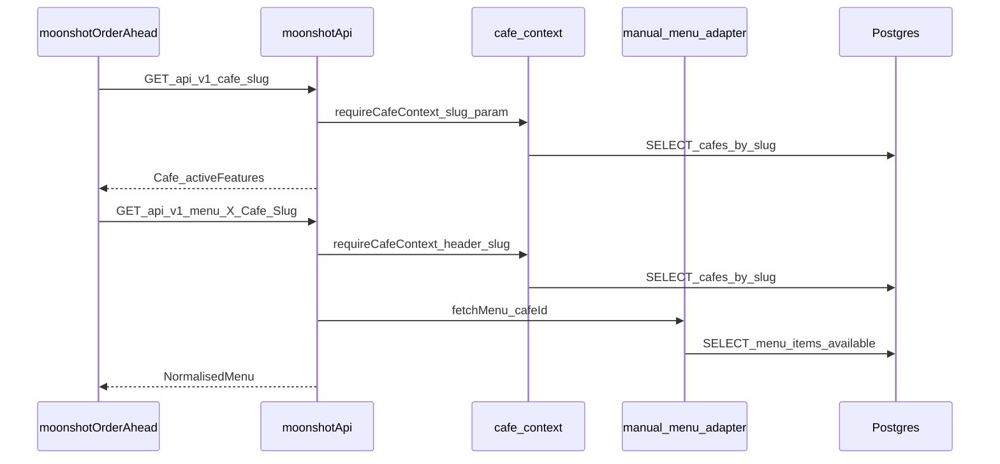
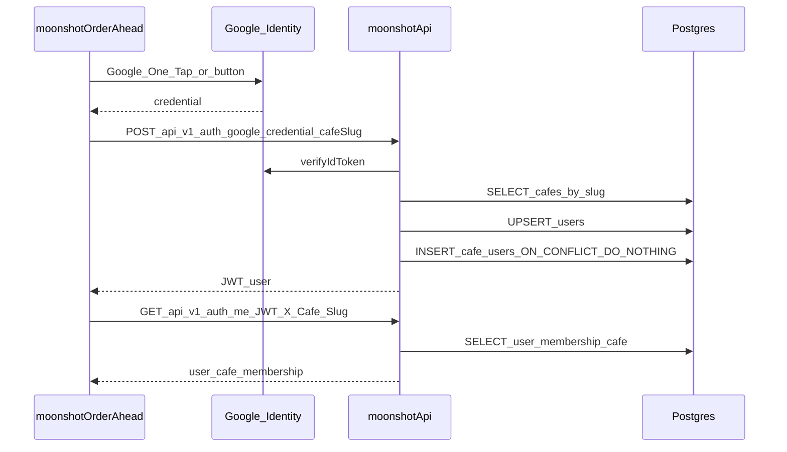
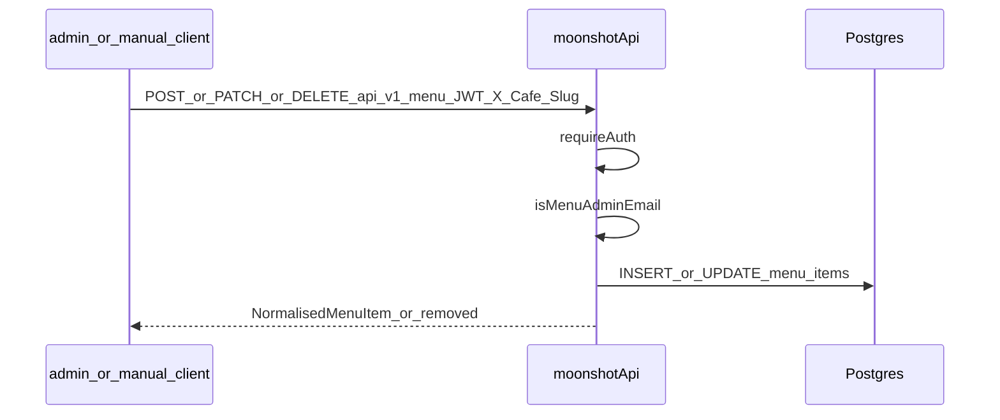
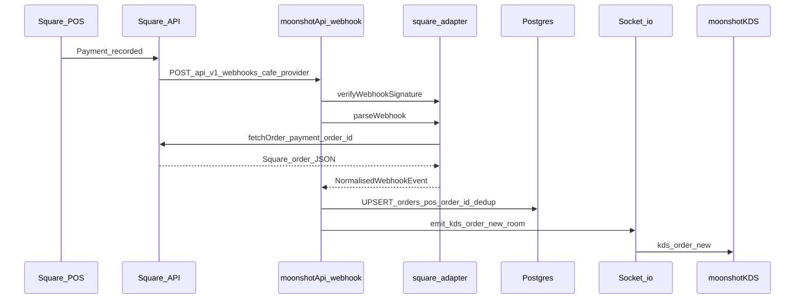
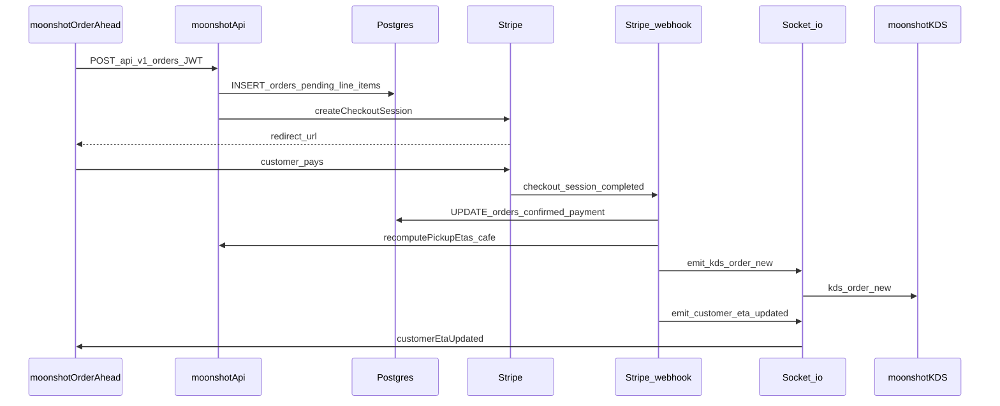
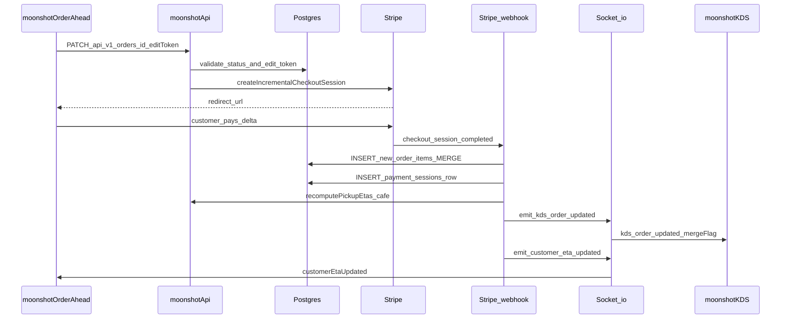
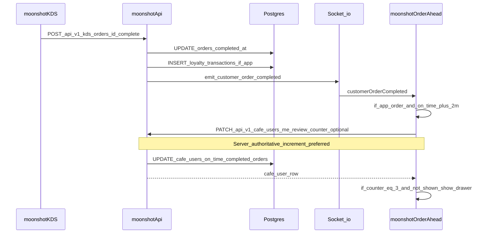
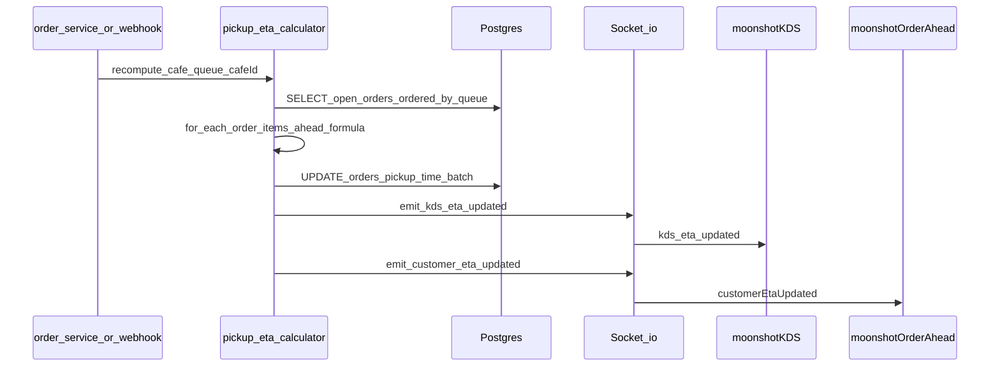

# Mid-level sequence diagrams

This file separates the current Phase 1 runtime from planned flows. Paths use the shared `API_VERSION_PREFIX`, currently `/api/v1`.

Implemented today:

- Café lookup and active feature loading.
- Manual menu reads from Postgres.
- Google auth and JWT session hydration.
- Menu admin writes through API routes.

Planned, not implemented yet:

- Orders and checkout.
- Stripe webhooks.
- POS webhooks/polling.
- Socket.io rooms/events.
- Pickup ETA recalculation.
- Loyalty and feedback persistence.

---

## S0 — Order-ahead startup: café + menu

Current runtime path for the customer app landing page and menu.

```mermaid
sequenceDiagram
  participant PWA as moonshotOrderAhead
  participant API as moonshotApi
  participant Cafe as cafe_context
  participant Menu as manual_menu_adapter
  participant DB as Postgres

  PWA->>API: GET_api_v1_cafe_slug
  API->>Cafe: requireCafeContext_slug_param
  Cafe->>DB: SELECT_cafes_by_slug
  API-->>PWA: Cafe_activeFeatures
  PWA->>API: GET_api_v1_menu_X_Cafe_Slug
  API->>Cafe: requireCafeContext_header_slug
  Cafe->>DB: SELECT_cafes_by_slug
  API->>Menu: fetchMenu_cafeId
  Menu->>DB: SELECT_menu_items_available
  API-->>PWA: NormalisedMenu
```

The order-ahead app builds API URLs from `VITE_API_URL + /api/v1`. `VITE_API_URL` should be the API origin only.

---

## S1 — Google sign-in and session hydration

Current runtime path for order-ahead profile/auth.

```mermaid
sequenceDiagram
  participant PWA as moonshotOrderAhead
  participant Google as Google_Identity
  participant API as moonshotApi
  participant DB as Postgres

  PWA->>Google: Google_One_Tap_or_button
  Google-->>PWA: credential
  PWA->>API: POST_api_v1_auth_google_credential_cafeSlug
  API->>Google: verifyIdToken
  API->>DB: SELECT_cafes_by_slug
  API->>DB: UPSERT_users
  API->>DB: INSERT_cafe_users_ON_CONFLICT_DO_NOTHING
  API-->>PWA: JWT_user
  PWA->>API: GET_api_v1_auth_me_JWT_X_Cafe_Slug
  API->>DB: SELECT_user_membership_cafe
  API-->>PWA: user_cafe_membership
```

The API requires `GOOGLE_CLIENT_ID` and `JWT_SECRET` for the sign-in route. Menu admin capability is currently represented by an `adminCafeIds` JWT claim when the signed-in email is in `MENU_ADMIN_EMAILS`.

---

## S2 — Manual menu admin writes

Current API capability. The admin app UI does not expose this yet.

```mermaid
sequenceDiagram
  participant AdminClient as admin_or_manual_client
  participant API as moonshotApi
  participant DB as Postgres

  AdminClient->>API: POST_or_PATCH_or_DELETE_api_v1_menu_JWT_X_Cafe_Slug
  API->>API: requireAuth
  API->>API: isMenuAdminEmail
  API->>DB: INSERT_or_UPDATE_menu_items
  API-->>AdminClient: NormalisedMenuItem_or_removed
```

`DELETE /api/v1/menu/:itemId` soft-disables a row by setting `is_available = FALSE`.

---

## F1 — Planned POS walk-in order (Square)

Square does not reliably emit `order.created` for register-originated orders; the intended resilient pattern is `payment.created` / `payment.updated` → fetch order by id → normalise → upsert Postgres → emit to KDS room.

```mermaid
sequenceDiagram
  participant POS as Square_POS
  participant SqAPI as Square_API
  participant WH as moonshotApi_webhook
  participant Ad as square_adapter
  participant DB as Postgres
  participant IO as Socket_io
  participant KDS as moonshotKDS

  POS->>SqAPI: Payment_recorded
  SqAPI->>WH: POST_api_v1_webhooks_cafe_provider
  WH->>Ad: verifyWebhookSignature
  WH->>Ad: parseWebhook
  Ad->>SqAPI: fetchOrder_payment_order_id
  SqAPI-->>Ad: Square_order_JSON
  Ad-->>WH: NormalisedWebhookEvent
  WH->>DB: UPSERT_orders_pos_order_id_dedup
  WH->>IO: emit_kds_order_new_room
  IO->>KDS: kds_order_new
```

Polling fallback remains planned as a safety net. Dedupe should be DB-level on `(cafe_id, pos_order_id)`.

---

## F2 — Planned order-ahead checkout

```mermaid
sequenceDiagram
  participant PWA as moonshotOrderAhead
  participant API as moonshotApi
  participant DB as Postgres
  participant St as Stripe
  participant WH as Stripe_webhook
  participant IO as Socket_io
  participant KDS as moonshotKDS

  PWA->>API: POST_api_v1_orders_JWT
  API->>DB: INSERT_orders_pending_line_items
  API->>St: createCheckoutSession
  St-->>PWA: redirect_url
  PWA->>St: customer_pays
  St->>WH: checkout_session_completed
  WH->>DB: UPDATE_orders_confirmed_payment
  WH->>API: recomputePickupEtas_cafe
  WH->>IO: emit_kds_order_new
  IO->>KDS: kds_order_new
  WH->>IO: emit_customer_eta_updated
  IO->>PWA: customerEtaUpdated
```

After payment confirmation, pickup ETA should be computed before the KDS sees the card.

---

## F3 — Planned order merge / add items

Customer edits an already placed order; server issues a delta Stripe Checkout for the price difference, then merges line items when paid.

```mermaid
sequenceDiagram
  participant PWA as moonshotOrderAhead
  participant API as moonshotApi
  participant DB as Postgres
  participant St as Stripe
  participant WH as Stripe_webhook
  participant IO as Socket_io
  participant KDS as moonshotKDS

  PWA->>API: PATCH_api_v1_orders_id_editToken
  API->>DB: validate_status_and_edit_token
  API->>St: createIncrementalCheckoutSession
  St-->>PWA: redirect_url
  PWA->>St: customer_pays_delta
  St->>WH: checkout_session_completed
  WH->>DB: INSERT_new_order_items_MERGE
  WH->>DB: INSERT_payment_sessions_row
  WH->>API: recomputePickupEtas_cafe
  WH->>IO: emit_kds_order_updated
  IO->>KDS: kds_order_updated_mergeFlag
  WH->>IO: emit_customer_eta_updated
  IO->>PWA: customerEtaUpdated
```

KDS contract target: `kds:order:updated` carries `mergeFlag: true` and `newItemIds: string[]`.

---

## F4 — Planned KDS done → loyalty → customer completion → review prompt gate

```mermaid
sequenceDiagram
  participant KDS as moonshotKDS
  participant API as moonshotApi
  participant DB as Postgres
  participant IO as Socket_io
  participant PWA as moonshotOrderAhead

  KDS->>API: POST_api_v1_kds_orders_id_complete
  API->>DB: UPDATE_orders_completed_at
  API->>DB: INSERT_loyalty_transactions_if_app
  API->>IO: emit_customer_order_completed
  IO->>PWA: customerOrderCompleted
  PWA->>PWA: if_app_order_and_on_time_plus_2m
  PWA->>API: PATCH_api_v1_cafe_users_me_review_counter_optional
  Note over PWA,API: Server_authoritative_increment_preferred
  API->>DB: UPDATE_cafe_users_on_time_completed_orders
  API-->>PWA: cafe_user_row
  PWA->>PWA: if_counter_eq_3_and_not_shown_show_drawer
```

On-time rule target: `completed_at <= pickup_time + 2 minutes`.

---

## F5 — Planned pickup ETA recalculation

Triggered whenever queue-affecting state changes: new confirmed order, merge paid, order completed/cancelled, or line items change prep weight.

```mermaid
sequenceDiagram
  participant Svc as order_service_or_webhook
  participant ETA as pickup_eta_calculator
  participant DB as Postgres
  participant IO as Socket_io
  participant KDS as moonshotKDS
  participant PWA as moonshotOrderAhead

  Svc->>ETA: recompute_cafe_queue_cafeId
  ETA->>DB: SELECT_open_orders_ordered_by_queue
  ETA->>ETA: for_each_order_items_ahead_formula
  ETA->>DB: UPDATE_orders_pickup_time_batch
  ETA->>IO: emit_kds_eta_updated
  IO->>KDS: kds_eta_updated
  ETA->>IO: emit_customer_eta_updated
  IO->>PWA: customerEtaUpdated
```

**v1 formula (rudimentary):** for each open order in FIFO queue order:

`pickup_time = now + base_prep_minutes + (sum_quantity_of_items_ahead * per_item_minutes)`

Constants `base_prep_minutes` and `per_item_minutes` live in `cafes.kds_config` JSON (see [schema-draft.md](schema-draft.md)).

---

## Planned socket event summary

| Event                     | Room / audience | Payload idea                                      |
| ------------------------- | --------------- | ------------------------------------------------- |
| `kds:order:new`           | KDS             | `{ order: NormalisedOrder }`                    |
| `kds:order:updated`       | KDS             | `{ order, mergeFlag?, newItemIds? }`            |
| `kds:order:removed`       | KDS             | `{ orderId }`                                     |
| `kds:eta:updated`         | KDS             | `{ updates: { orderId, pickupTime }[] }`          |
| `customerOrderCompleted`  | customer        | `{ orderId, cafeId, completedAt }`                |
| `customerEtaUpdated`      | customer        | `{ updates: { orderId, pickupTime }[] }`          |

Exact shapes are defined in `@moonshot/types` (`KdsSocketEvent`, `CustomerSocketEvent`).
