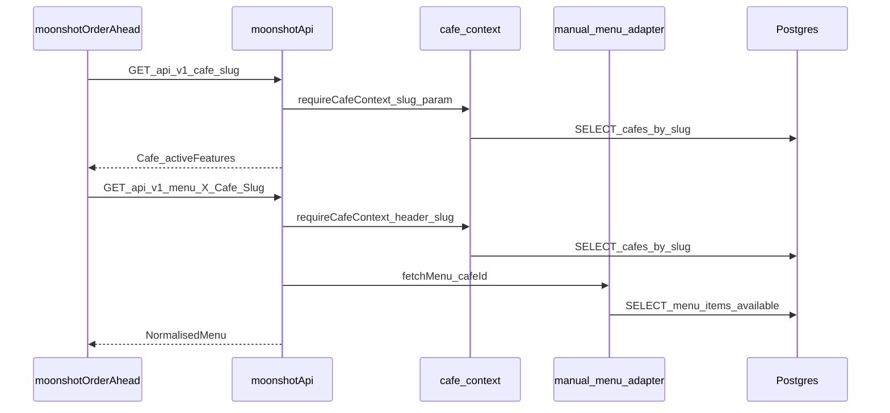
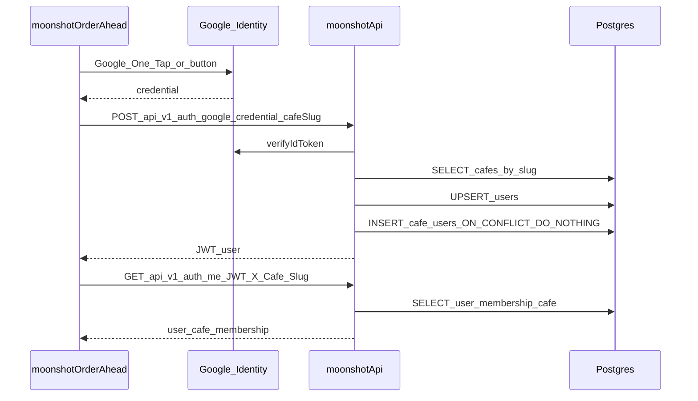
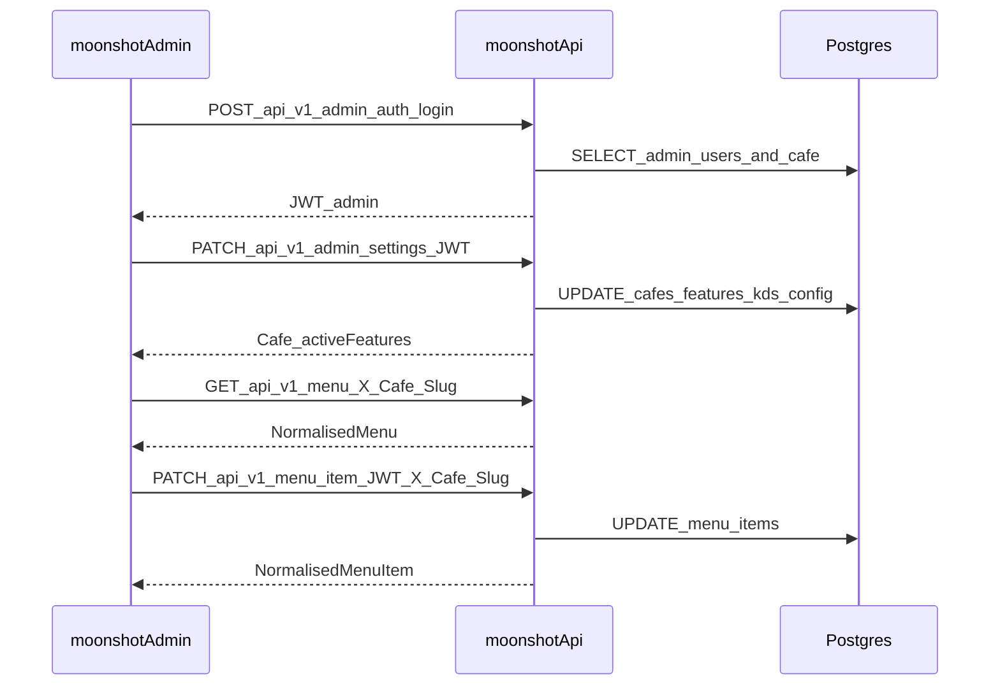
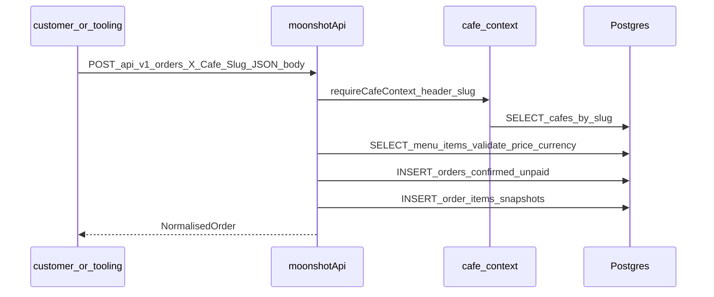
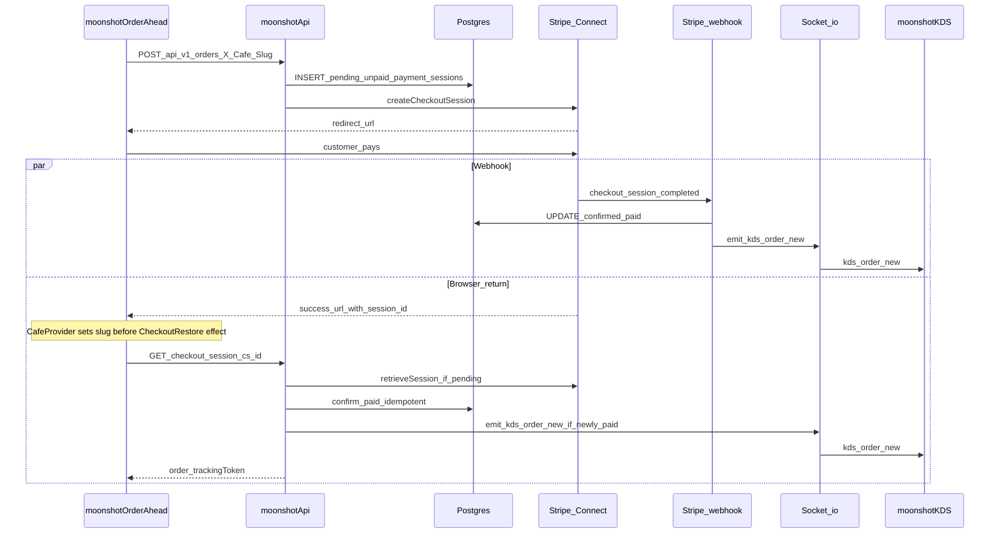
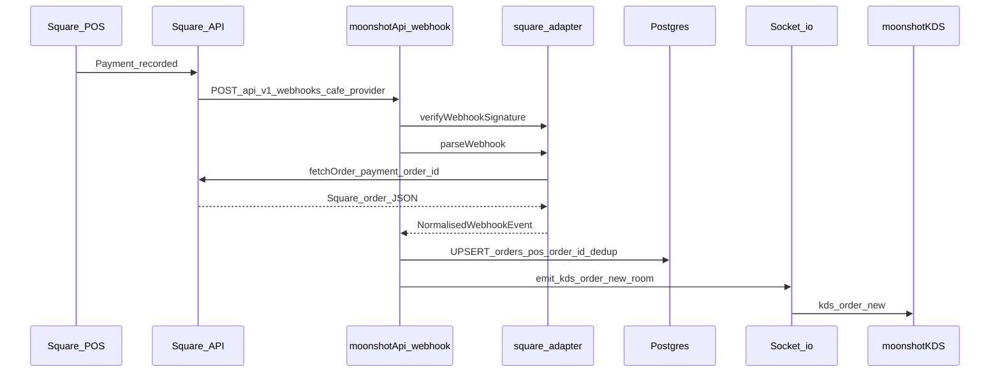
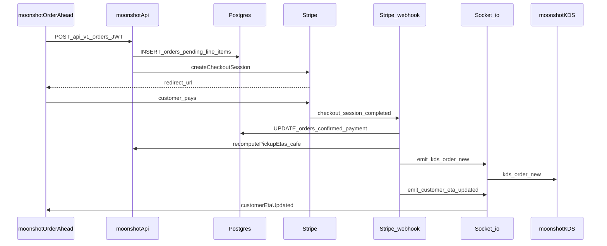
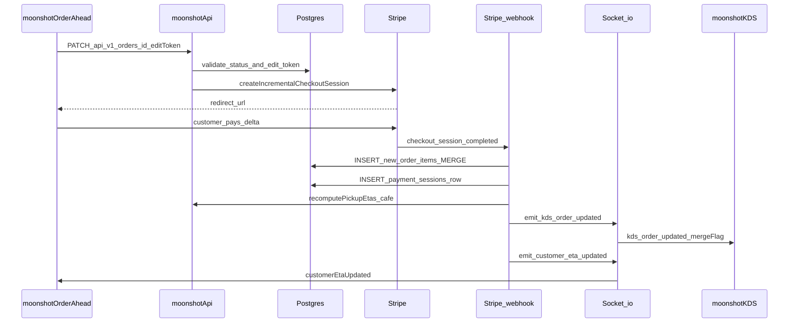
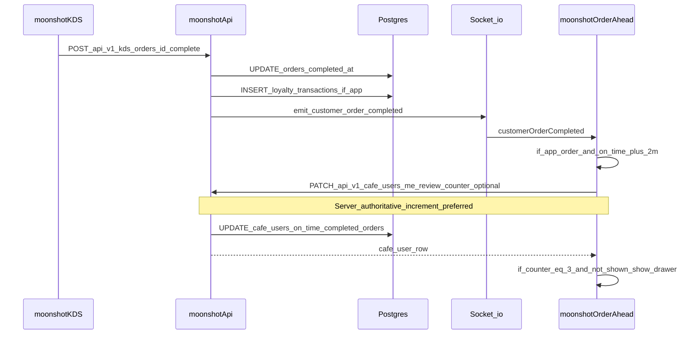
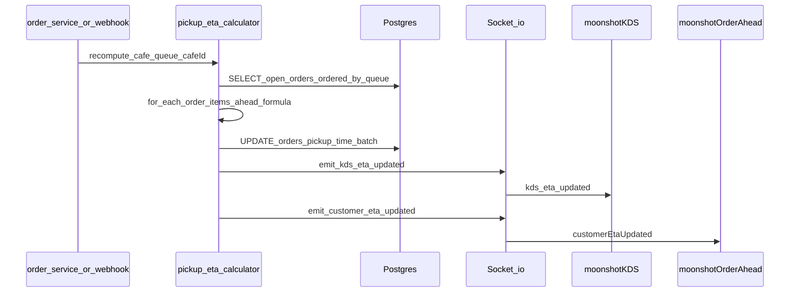

# Mid-level sequence diagrams

This file separates current runtime behaviour from planned flows. Paths use the shared `API_VERSION_PREFIX`, currently `/api/v1`.

Implemented today:

- Café lookup and active feature loading.
- Manual menu reads from Postgres (POS adapter boundary passes **`posConfig`** for future non-manual providers — see [pos-normalisation.md](pos-normalisation.md)).
- Google auth and JWT session hydration.
- Pre-seeded admin login plus settings updates for order-ahead and KDS configuration; **Stripe Connect onboarding** via admin routes + **`payment_config.stripe`** cache.
- Menu admin writes through API routes; the admin UI currently exposes item price, availability, and modifier option price edits.
- **Pay-in-store** order creation when `features.order_ahead.paymentProvider === 'pay_in_store'`: `POST /api/v1/orders` persists **`confirmed` / `unpaid`**, validates **modifiers** from `menu_items.modifier_groups`, emits **`kds:order:new`**, FIFO **pickup ETA** recalculation + **`kds:eta:updated`** / **`customerEtaUpdated`**.
- **Stripe Checkout** when `paymentProvider === 'stripe'`: same `POST /orders` creates **`pending` / `unpaid`**, returns **`checkoutUrl`**; confirmation via **`checkout.session.completed`** webhook **or** browser return (`GET /orders/checkout-session/:id` recovery). Then **`paid` / `confirmed`**, **`kds:order:new`** + ETA recompute. Platform **`ORDER_AHEAD_BASE_URL`** builds per-slug return URLs. Cafés without **Connect + charges enabled** are rejected at order time.
- Café-scoped **KDS login** (JWT **90d**), **open orders**, **complete order**, and **`/kds`** Socket.io.
- **Customer** **`/customer`** tracking: completion, **ETA pushes**, optional **`customerReviewEligible`** after simple loyalty counters on KDS complete.

Planned, not implemented yet:

- POS webhooks/polling (Square, etc.) beyond manual adapter notes.
- Stripe incremental checkout / order merge (F3) and richer loyalty ledger tables.

---

## S0 — Order-ahead startup: café + menu

Current runtime path for the customer app landing page and menu.

```mermaid
sequenceDiagram
  participant PWA as moonshotOrderAhead
  participant API as moonshotApi
  participant Cafe as cafe_context
  participant Menu as manual_menu_adapter
  participant DB as Postgres

  PWA->>API: GET_api_v1_cafe_slug
  API->>Cafe: requireCafeContext_slug_param
  Cafe->>DB: SELECT_cafes_by_slug
  API-->>PWA: Cafe_activeFeatures
  PWA->>API: GET_api_v1_menu_X_Cafe_Slug
  API->>Cafe: requireCafeContext_header_slug
  Cafe->>DB: SELECT_cafes_by_slug
  API->>Menu: fetchMenu_cafeId
  Menu->>DB: SELECT_menu_items_available
  API-->>PWA: NormalisedMenu
```

The order-ahead app builds API URLs from `VITE_API_URL + /api/v1`. `VITE_API_URL` should be the API origin only.

---

## S1 — Google sign-in and session hydration

Current runtime path for order-ahead profile/auth.

```mermaid
sequenceDiagram
  participant PWA as moonshotOrderAhead
  participant Google as Google_Identity
  participant API as moonshotApi
  participant DB as Postgres

  PWA->>Google: Google_One_Tap_or_button
  Google-->>PWA: credential
  PWA->>API: POST_api_v1_auth_google_credential_cafeSlug
  API->>Google: verifyIdToken
  API->>DB: SELECT_cafes_by_slug
  API->>DB: UPSERT_users
  API->>DB: INSERT_cafe_users_ON_CONFLICT_DO_NOTHING
  API-->>PWA: JWT_user
  PWA->>API: GET_api_v1_auth_me_JWT_X_Cafe_Slug
  API->>DB: SELECT_user_membership_cafe
  API-->>PWA: user_cafe_membership
```

The API requires `GOOGLE_CLIENT_ID` and `JWT_SECRET` for the sign-in route. Menu admin capability can come from either a pre-seeded admin JWT (`purpose: admin`) or a Google/session JWT whose email is in `MENU_ADMIN_EMAILS`.

---

## S2 — Admin settings + manual menu maintenance

Current runtime path for the admin app. Admin accounts are pre-seeded; invite/onboarding flows are still planned.

```mermaid
sequenceDiagram
  participant Admin as moonshotAdmin
  participant API as moonshotApi
  participant DB as Postgres

  Admin->>API: POST_api_v1_admin_auth_login
  API->>DB: SELECT_admin_users_and_cafe
  API-->>Admin: JWT_admin
  Admin->>API: PATCH_api_v1_admin_settings_JWT
  API->>DB: UPDATE_cafes_features_kds_config
  API-->>Admin: Cafe_activeFeatures
  Admin->>API: GET_api_v1_menu_X_Cafe_Slug
  API-->>Admin: NormalisedMenu
  Admin->>API: PATCH_api_v1_menu_item_JWT_X_Cafe_Slug
  API->>DB: UPDATE_menu_items
  API-->>Admin: NormalisedMenuItem
```

The API also supports `POST /api/v1/menu` and `DELETE /api/v1/menu/:itemId` for manual clients. The current admin UI is narrower: it edits existing item price, availability, and modifier option prices; `DELETE` soft-disables a row by setting `is_available = FALSE`.

---

## S3 — Guest pay-in-store order creation

Current API capability for the core ordering loop without Stripe. Intended for development and pay-in-store flows; the order-ahead PWA **can** call this route from the menu basket (guest pay-in-store).

```mermaid
sequenceDiagram
  participant Client as customer_or_tooling
  participant API as moonshotApi
  participant Cafe as cafe_context
  participant DB as Postgres

  Client->>API: POST_api_v1_orders_X_Cafe_Slug_JSON_body
  API->>Cafe: requireCafeContext_header_slug
  Cafe->>DB: SELECT_cafes_by_slug
  API->>DB: SELECT_menu_items_validate_price_currency
  API->>DB: INSERT_orders_confirmed_unpaid
  API->>DB: INSERT_order_items_snapshots
  API-->>Client: NormalisedOrder
```

Request body uses `CreateOrderRequest` from `@moonshot/types`: `customerName`, optional `notes`, `orderType`, and `items[]` with `menuItemId` and `quantity`. **Do not trust client prices:** totals and unit prices come from `menu_items`.

**KDS:** listing open orders and completing orders are public HTTP routes guarded by café-scoped KDS JWTs; the repository functions remain the shared persistence layer behind those routes.

---

## S4 — Stripe Checkout + browser return recovery

Implemented path when `paymentProvider === 'stripe'`. See [stripe-checkout-return.md](stripe-checkout-return.md).

```mermaid
sequenceDiagram
  participant PWA as moonshotOrderAhead
  participant API as moonshotApi
  participant DB as Postgres
  participant St as Stripe_Connect
  participant WH as Stripe_webhook
  participant IO as Socket_io
  participant KDS as moonshotKDS

  PWA->>API: POST_api_v1_orders_X_Cafe_Slug
  API->>DB: INSERT_pending_unpaid_payment_sessions
  API->>St: createCheckoutSession
  St-->>PWA: redirect_url
  PWA->>St: customer_pays
  par Webhook
    St->>WH: checkout_session_completed
    WH->>DB: UPDATE_confirmed_paid
    WH->>IO: emit_kds_order_new
    IO->>KDS: kds_order_new
  and Browser_return
    St-->>PWA: success_url_with_session_id
    Note over PWA: CafeProvider sets slug before CheckoutRestore effect
    PWA->>API: GET_checkout_session_cs_id
    API->>St: retrieveSession_if_pending
    API->>DB: confirm_paid_idempotent
    API->>IO: emit_kds_order_new_if_newly_paid
    IO->>KDS: kds_order_new
    API-->>PWA: order_trackingToken
  end
```

---

## F1 — Planned POS walk-in order (Square)

Square does not reliably emit `order.created` for register-originated orders; the intended resilient pattern is `payment.created` / `payment.updated` → fetch order by id → normalise → upsert Postgres → emit to KDS room.

```mermaid
sequenceDiagram
  participant POS as Square_POS
  participant SqAPI as Square_API
  participant WH as moonshotApi_webhook
  participant Ad as square_adapter
  participant DB as Postgres
  participant IO as Socket_io
  participant KDS as moonshotKDS

  POS->>SqAPI: Payment_recorded
  SqAPI->>WH: POST_api_v1_webhooks_cafe_provider
  WH->>Ad: verifyWebhookSignature
  WH->>Ad: parseWebhook
  Ad->>SqAPI: fetchOrder_payment_order_id
  SqAPI-->>Ad: Square_order_JSON
  Ad-->>WH: NormalisedWebhookEvent
  WH->>DB: UPSERT_orders_pos_order_id_dedup
  WH->>IO: emit_kds_order_new_room
  IO->>KDS: kds_order_new
```

Polling fallback remains planned as a safety net. Dedupe should be DB-level on `(cafe_id, pos_order_id)`.

---

## F2 — Planned order-ahead checkout (superseded by S4)

Historical diagram; live behaviour is **S4** above. F3 merge flow still planned.

```mermaid
sequenceDiagram
  participant PWA as moonshotOrderAhead
  participant API as moonshotApi
  participant DB as Postgres
  participant St as Stripe
  participant WH as Stripe_webhook
  participant IO as Socket_io
  participant KDS as moonshotKDS

  PWA->>API: POST_api_v1_orders_JWT
  API->>DB: INSERT_orders_pending_line_items
  API->>St: createCheckoutSession
  St-->>PWA: redirect_url
  PWA->>St: customer_pays
  St->>WH: checkout_session_completed
  WH->>DB: UPDATE_orders_confirmed_payment
  WH->>API: recomputePickupEtas_cafe
  WH->>IO: emit_kds_order_new
  IO->>KDS: kds_order_new
  WH->>IO: emit_customer_eta_updated
  IO->>PWA: customerEtaUpdated
```

After payment confirmation, pickup ETA should be computed before the KDS sees the card.

---

## F3 — Planned order merge / add items

Customer edits an already placed order; server issues a delta Stripe Checkout for the price difference, then merges line items when paid.

```mermaid
sequenceDiagram
  participant PWA as moonshotOrderAhead
  participant API as moonshotApi
  participant DB as Postgres
  participant St as Stripe
  participant WH as Stripe_webhook
  participant IO as Socket_io
  participant KDS as moonshotKDS

  PWA->>API: PATCH_api_v1_orders_id_editToken
  API->>DB: validate_status_and_edit_token
  API->>St: createIncrementalCheckoutSession
  St-->>PWA: redirect_url
  PWA->>St: customer_pays_delta
  St->>WH: checkout_session_completed
  WH->>DB: INSERT_new_order_items_MERGE
  WH->>DB: INSERT_payment_sessions_row
  WH->>API: recomputePickupEtas_cafe
  WH->>IO: emit_kds_order_updated
  IO->>KDS: kds_order_updated_mergeFlag
  WH->>IO: emit_customer_eta_updated
  IO->>PWA: customerEtaUpdated
```

KDS contract target: `kds:order:updated` carries `mergeFlag: true` and `newItemIds: string[]`.

---

## F4 — Planned KDS done → loyalty → customer completion → review prompt gate

```mermaid
sequenceDiagram
  participant KDS as moonshotKDS
  participant API as moonshotApi
  participant DB as Postgres
  participant IO as Socket_io
  participant PWA as moonshotOrderAhead

  KDS->>API: POST_api_v1_kds_orders_id_complete
  API->>DB: UPDATE_orders_completed_at
  API->>DB: INSERT_loyalty_transactions_if_app
  API->>IO: emit_customer_order_completed
  IO->>PWA: customerOrderCompleted
  PWA->>PWA: if_app_order_and_on_time_plus_2m
  PWA->>API: PATCH_api_v1_cafe_users_me_review_counter_optional
  Note over PWA,API: Server_authoritative_increment_preferred
  API->>DB: UPDATE_cafe_users_on_time_completed_orders
  API-->>PWA: cafe_user_row
  PWA->>PWA: if_counter_eq_3_and_not_shown_show_drawer
```

On-time rule target: `completed_at <= pickup_time + 2 minutes`.

---

## F5 — Planned pickup ETA recalculation

Triggered whenever queue-affecting state changes: new confirmed order, merge paid, order completed/cancelled, or line items change prep weight.

```mermaid
sequenceDiagram
  participant Svc as order_service_or_webhook
  participant ETA as pickup_eta_calculator
  participant DB as Postgres
  participant IO as Socket_io
  participant KDS as moonshotKDS
  participant PWA as moonshotOrderAhead

  Svc->>ETA: recompute_cafe_queue_cafeId
  ETA->>DB: SELECT_open_orders_ordered_by_queue
  ETA->>ETA: for_each_order_items_ahead_formula
  ETA->>DB: UPDATE_orders_pickup_time_batch
  ETA->>IO: emit_kds_eta_updated
  IO->>KDS: kds_eta_updated
  ETA->>IO: emit_customer_eta_updated
  IO->>PWA: customerEtaUpdated
```

**v1 formula (rudimentary):** for each open order in FIFO queue order:

`pickup_time = now + base_prep_minutes + (sum_quantity_of_items_ahead * per_item_minutes)`

Constants `base_prep_minutes` and `per_item_minutes` live in `cafes.kds_config` JSON (see [schema-draft.md](schema-draft.md)).

---

## Planned socket event summary

| Event                     | Room / audience | Payload idea                                      |
| ------------------------- | --------------- | ------------------------------------------------- |
| `kds:order:new`           | KDS             | `{ order: NormalisedOrder }`                    |
| `kds:order:updated`       | KDS             | `{ order, mergeFlag?, newItemIds? }`            |
| `kds:order:removed`       | KDS             | `{ orderId }`                                     |
| `kds:eta:updated`         | KDS             | `{ updates: { orderId, pickupTime }[] }`          |
| `customerOrderCompleted`  | customer        | `{ orderId, cafeId, completedAt }`                |
| `customerEtaUpdated`      | customer        | `{ updates: { orderId, pickupTime }[] }`          |

Exact shapes are defined in `@moonshot/types` (`KdsSocketEvent`, customer `CustomerServerToClientEvent`).
