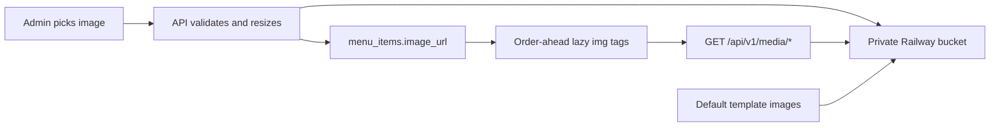

# Menu images (Railway Object Storage)

Menu item thumbnails are stored in **Railway Object Storage** (S3-compatible). The bucket stays **private**. The API validates uploads, resizes to a small WebP thumbnail, uploads to the bucket, and persists a stable URL in `menu_items.image_url`. Browsers load images via a public **API media route** that streams from the bucket.

## Architecture



## Railway setup

1. In your Railway project, create an **Object Storage** bucket (e.g. `moonshot-menu-images`).
2. Connect credentials to the **API service** using `MENU_IMAGE_*` names (not the dialog’s default `AWS_*`).
3. Railway buckets have **no public URL** — set `MENU_IMAGE_PUBLIC_BASE_URL` to your API media prefix instead.
4. Set these variables on the **API service**:

| Variable | Description |
|----------|-------------|
| `MENU_IMAGE_BUCKET` | Bucket name |
| `MENU_IMAGE_ENDPOINT` | S3 endpoint URL (API access only — not for ``) |
| `MENU_IMAGE_REGION` | Region (`auto` is fine for Railway) |
| `MENU_IMAGE_ACCESS_KEY_ID` | Access key |
| `MENU_IMAGE_SECRET_ACCESS_KEY` | Secret key |
| `MENU_IMAGE_PUBLIC_BASE_URL` | `https://<your-api-host>/api/v1/media` (no trailing slash) |

Example:

```
MENU_IMAGE_PUBLIC_BASE_URL=https://your-api.up.railway.app/api/v1/media
```

The order-ahead and admin frontends **do not** need bucket credentials.

## Object key layout

| Path | Purpose |
|------|---------|
| `template/drinks/{drink-key}.webp` | Canonical starter template thumbnails |
| `cafes/{cafeId}/menu-items/{itemId}/thumbnail.webp` | Per-café item uploads |

Public browser URLs are `{MENU_IMAGE_PUBLIC_BASE_URL}/{objectKey}`.

## Media API (read)

`GET /api/v1/media/*`

- Auth: none (catalogue thumbnails are public)
- Allowlisted keys only (template drinks + café item thumbnails)
- Streams the object from the private bucket
- Headers: `Content-Type`, `Cache-Control: public, max-age=31536000, immutable`, `Cross-Origin-Resource-Policy: cross-origin`

## Upload API (write)

`POST /api/v1/menu/:itemId/image`

- Auth: admin JWT + `X-Cafe-Slug`
- Body: `multipart/form-data` with field `image`
- Accepts: JPEG, PNG, WebP (validated from file bytes)
- Max upload: 5MB
- Output: 360×240 WebP thumbnail, metadata stripped
- Response: updated `NormalisedMenuItem` with `imageUrl`

## Starter template defaults

On onboarding template save, each drink row gets `image_url` pointing at:

`{MENU_IMAGE_PUBLIC_BASE_URL}/template/drinks/{templateKey}.webp`

Sync default images to the bucket:

```bash
cd apps/moonshot-api
pnpm sync:menu-template-images
```

The script reads optional sources from `assets/menu-template/drinks/{key}.webp` or generates coloured placeholders, then uploads to Railway.

Run this once per environment after creating the bucket, and again when you add new template drink keys.

After sync + deploy, verify in a browser:

`https://<your-api-host>/api/v1/media/template/drinks/flat-white.webp`

## Performance

- One thumbnail variant per item (card size ~360×240 WebP, quality ~80).
- Objects use `Cache-Control: public, max-age=31536000, immutable`.
- Deterministic keys mean replacing an image overwrites the same URL; switch to versioned keys if cache busting becomes necessary.
- Order-ahead uses `loading="lazy"` and `decoding="async"` except the first featured / item-detail hero image.

## Admin UI

Dashboard → Menu & pricing → expand an item → **Upload photo** / **Replace photo**. New items must be saved before a photo can be uploaded.

## Local development

Without `MENU_IMAGE_*` configured:

- Template onboarding sets `image_url` to `null`.
- Image upload returns `503` with a clear error.
- Media GET returns `503`.
- Order-ahead shows neutral placeholders.

For full local testing, create a dev bucket on Railway and point env vars at it, with:

```
MENU_IMAGE_PUBLIC_BASE_URL=http://localhost:<api-port>/api/v1/media
```
