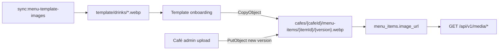

# Menu images (Railway Object Storage)

Menu item thumbnails are stored in **Railway Object Storage** (S3-compatible). The bucket stays **private**. The API validates uploads, resizes to a small WebP thumbnail, uploads to the bucket, and persists a URL in `menu_items.image_url`. Browsers load images via a public **API media route** that streams from the bucket.

## Ownership model

| Layer | Who edits | Object keys |
|-------|-----------|-------------|
| **Canonical templates** | Superadmin / ops only (`pnpm sync:menu-template-images`) | `template/drinks/{drink-key}.webp` |
| **Per-café copies** | Café admin (Dashboard upload) | `cafes/{cafeId}/menu-items/{itemId}/{version}.webp` |

On template onboarding, each drink **copies** the canonical template into café-scoped storage and points `image_url` at that copy. A café replace only rewrites that café’s object — never `template/drinks/*`. Updating the master templates (sync script) affects **new** cafés on next onboard; existing café copies stay as they were until that café replaces them.



## Railway setup

1. In your Railway project, create an **Object Storage** bucket (e.g. `moonshot-menu-images`).
2. Connect credentials to the **API service** using `MENU_IMAGE_*` names (not the dialog’s default `AWS_*`).
3. Railway buckets have **no public URL** — set `MENU_IMAGE_PUBLIC_BASE_URL` to your API media prefix instead.
4. Set these variables on the **API service**:

| Variable | Description |
|----------|-------------|
| `MENU_IMAGE_BUCKET` | Bucket name |
| `MENU_IMAGE_ENDPOINT` | S3 endpoint URL (API access only — not for ``) |
| `MENU_IMAGE_REGION` | Region (`auto` is fine for Railway) |
| `MENU_IMAGE_ACCESS_KEY_ID` | Access key |
| `MENU_IMAGE_SECRET_ACCESS_KEY` | Secret key |
| `MENU_IMAGE_PUBLIC_BASE_URL` | `https://<your-api-host>/api/v1/media` (no trailing slash) |

Example:

```
MENU_IMAGE_PUBLIC_BASE_URL=https://your-api.up.railway.app/api/v1/media
```

The order-ahead and admin frontends **do not** need bucket credentials.

See also [apps/moonshot-api/.env.example](../apps/moonshot-api/.env.example).

## Object key layout

| Path | Purpose |
|------|---------|
| `template/drinks/{drink-key}.webp` | Canonical starter thumbnails (superadmin / sync only) |
| `cafes/{cafeId}/menu-items/{itemId}/{version}.webp` | Per-café working copies and uploads (`version` is a base36 timestamp) |

Legacy café keys ending in `thumbnail.webp` remain readable so existing URLs keep working. Older rows that still point at shared `template/drinks/…` URLs keep working until each café replaces that item’s photo (replace writes a café-scoped key).

Public browser URLs are `{MENU_IMAGE_PUBLIC_BASE_URL}/{objectKey}`.

## Media API (read)

`GET /api/v1/media/*`

- Auth: none (catalogue thumbnails are public)
- Allowlisted keys only (template drinks + café item thumbnails)
- Streams the object from the private bucket
- Headers: `Content-Type`, `Cache-Control: public, max-age=31536000, immutable`, `Cross-Origin-Resource-Policy: cross-origin`

## Upload API (write)

`POST /api/v1/menu/:itemId/image`

- Auth: admin JWT + `X-Cafe-Slug`
- Body: `multipart/form-data` with field `image`
- Accepts: JPEG, PNG, WebP (validated from file bytes)
- Max upload: 5MB
- Output: 480×320 WebP thumbnail (`fit: contain`, white letterbox, quality 90) under **that café’s** object prefix only
- Object key is **versioned** on every upload so browsers with long-lived immutable caches see the new image as soon as menu data refreshes
- Previous **café-scoped** object is deleted best-effort; shared `template/` objects are never deleted
- Response: updated `NormalisedMenuItem` with `imageUrl`

## Superadmin template defaults

Canonical templates are **not** editable from the café admin UI. Update them by syncing files:

**Required before onboarding cafés:** run the sync so `template/drinks/*.webp` exist. Onboarding copies those objects per item; if a template is missing, that item’s `image_url` stays `null`.

**There is no deploy-time photo pickup.** Sync is a manual script (local `.env` or `railway run`).

### Ops: seed / update master template photos

1. Ensure `MENU_IMAGE_*` is set on the API (and locally if syncing from your machine).
2. Drop real photos into `apps/moonshot-api/assets/menu-template/drinks/` named by drink key:
   - Prefer `{key}.webp`, or `{key}.jpg` / `{key}.jpeg` / `{key}.png`
   - Keys: `espresso`, `americano`, `macchiato`, `cortado`, `flat-white`, `latte`, `cappuccino`, `mocha`, `hot-chocolate`, `breakfast-tea`, `chai-latte`, `matcha-latte`, `iced-latte`, `iced-americano`, `iced-chocolate`, `iced-mocha`, `iced-matcha-latte`
3. Run:

```bash
cd apps/moonshot-api
pnpm sync:menu-template-images
```

The script converts JPEG/PNG/WebP sources to the catalogue thumbnail size, or generates a coloured placeholder when a file is missing, then uploads to `template/drinks/`.

4. Verify: `https://<your-api-host>/api/v1/media/template/drinks/flat-white.webp`

**Cache note for templates:** template object keys are stable. Replacing master bytes reuses the same URL (hard refresh may be needed for already-cached placeholders). Café copies use versioned keys and do not share that problem.

Do not commit large binary drink photos unless the team explicitly wants them in-repo; local/CI sync is enough.

## Performance

- One thumbnail variant per item (card size ~480×320 WebP, quality 90, full drink visible via contain + white letterbox).
- Objects use `Cache-Control: public, max-age=31536000, immutable`.
- Café uploads use versioned keys so each replace gets a new URL (menu JSON is still cached ~5 minutes on public GET).
- Order-ahead uses `loading="lazy"` and `decoding="async"` except the first featured / item-detail hero image.

## Admin UI

Dashboard → Menu & pricing → expand an item → **Upload photo** / **Replace photo**. New items must be saved before a photo can be uploaded. Replaces only that café’s copy.

## Local development

Without `MENU_IMAGE_*` configured:

- Template onboarding sets `image_url` to `null`.
- Image upload returns `503` with a clear error.
- Media GET returns `503`.
- Order-ahead shows neutral placeholders.

For full local testing, create a dev bucket on Railway and point env vars at it, with:

```
MENU_IMAGE_PUBLIC_BASE_URL=http://localhost:<api-port>/api/v1/media
```
