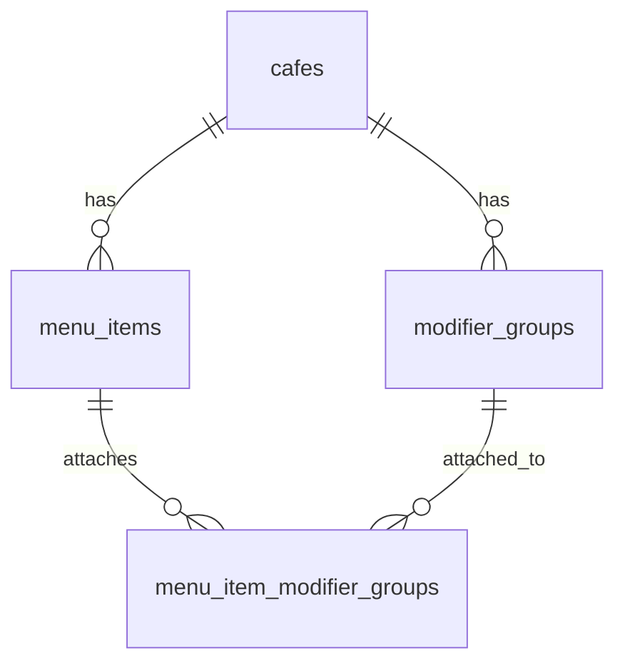

# Menu management

Cafés on the **manual** POS adapter manage their catalogue via the admin dashboard (`MenuManager`). Customer order-ahead reads the same normalised contract from `GET /api/v1/menu`.

## Concepts

| Concept | Purpose |
| -------- | ------- |
| **Menu item** | A product (latte, croissant) with category, optional description, base price or sizes |
| **Size** | Per-item absolute prices (S/M/L). Empty `sizes` → single-price item uses `price_minor` |
| **Modifier section** | Café-level reusable library (Milks, Syrups, Toppings) attached per item |
| **KDS metadata** | `colorHex` + `chipLabel` on sizes and options for future colour-coded KDS chips |

Milks and syrups are **not** menu categories — they are modifier sections attached only where needed.

## Data model

- `menu_items.sizes` — JSONB array of `NormalisedItemSize`
- `menu_items.modifier_groups` — legacy embedded groups (still merged for back-compat)
- `modifier_groups` — café library (`options` JSONB includes `colorHex`, `chipLabel`)
- `menu_item_modifier_groups` — ordered attachment join

Migration: `012_menu_modifier_library.sql`

## API (admin JWT + `X-Cafe-Slug`)

| Method | Path | Notes |
| ------ | ---- | ----- |
| GET | `/menu/manage` | Full menu incl. hidden items |
| POST/PATCH/DELETE | `/menu`, `/menu/:id` | Item CRUD; PATCH accepts `sizes`, `modifierGroupIds` |
| GET/POST/PATCH/DELETE | `/menu/modifier-groups` | Library CRUD |

Order checkout resolves prices server-side: size absolute base + modifier deltas. Free options use `priceMinor: 0`; customer UI hides `£0.00` tags via `formatPriceTag`.

## Admin UI

Dashboard **Menu & pricing** → tabs:

1. **Items** — create/edit/hide items, sizes, attach sections
2. **Sections** — manage Milks/Syrups/Toppings library with KDS colour + chip label

New cafés receive a starter library (Milks + Syrups) from `seedDefaultModifierLibrary`.

## Future: AI menu scan

Photo upload should output the same draft shape (items, categories, sizes, suggested sections) for human review before publish — reusing this admin UI as the review surface.
