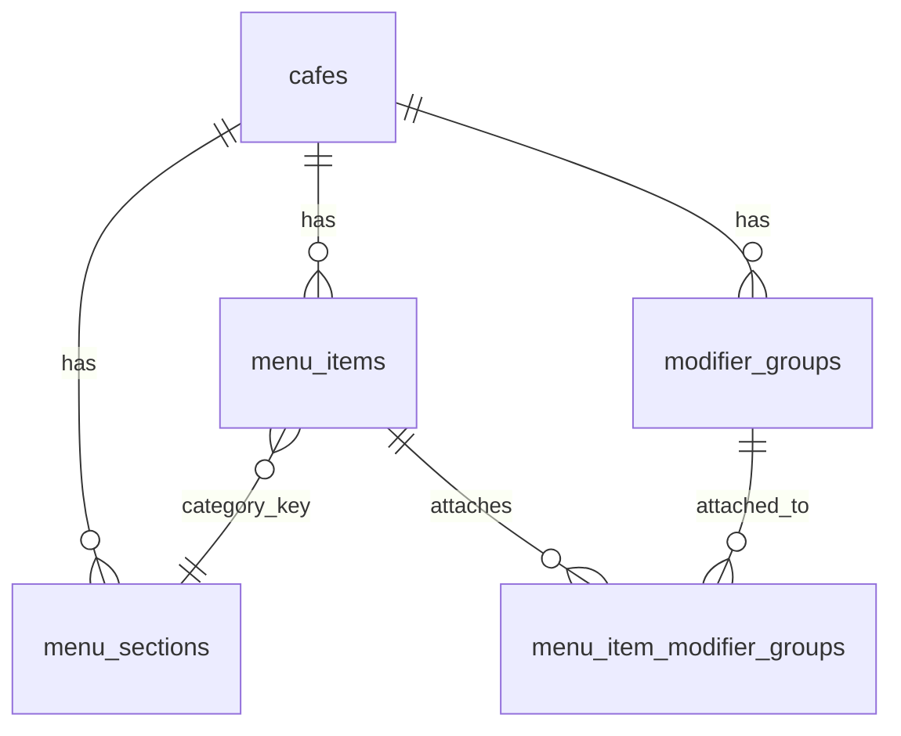

# Menu management

Cafés on the **manual** POS adapter manage their catalogue via the admin dashboard (`MenuManager`). Customer order-ahead reads the same normalised contract from `GET /api/v1/menu`.

## Concepts

| Concept | Purpose |
| -------- | ------- |
| **Menu section** | Café-scoped top-level grouping (`hot_drinks`, `cold_drinks`, `food`, or custom e.g. `ube`) |
| **Menu item** | A product (latte, croissant) with a section `category` key, optional description, base price or sizes |
| **Drink type (archetype)** | Platform recipe (espresso-neat, milk-forward-hot, …) that picks which modifier slots attach and whether alt-milk surcharge is waived |
| **Size** | Per-item absolute prices (S/M/L). Empty `sizes` → single-price item uses `price_minor` |
| **Modifier section** | Café-level reusable library (Milks, Syrups, Toppings, Ice Level, …) attached per item |
| **KDS metadata** | `colorHex` + `chipLabel` on sizes and options for future colour-coded KDS chips |

Milks and syrups are **not** menu sections — they are modifier library groups attached only where needed.

**Food** is a permanent system section: disabled by default, always visible in admin with “No current food items” until enabled or items are added. Custom sections are created with a simple name field (slugified to a key).

## Drink archetypes

Each drink item can store:

- `archetype` — id from the platform catalogue (`espresso-neat`, `low-milk-hot`, …)
- `waive_milk_surcharge` — when true, Milks option prices are treated as £0 on that item (display + checkout)

Café recipes live in `cafes.drink_archetype_config` (JSONB). Empty/`{}` means use platform defaults; admin saves a full snapshot. Editing a recipe does **not** rewrite existing items until the owner clicks **Apply to items** for that type.

| Archetype | Default slots | Milk charge |
| --- | --- | --- |
| espresso-neat | shots, beans | none |
| low-milk-hot | milk, shots, beans | waived |
| milk-forward-hot | milk, syrup, shots, milk_temperature, milk_texture, beans | standard |
| non-coffee-milk-hot | milk, syrup, milk_temperature, toppings | standard |
| tea | milk | waived |
| low-milk-iced | milk, shots, ice_level | waived |
| milk-forward-iced | milk, syrup, shots, ice_level, beans | standard |
| non-coffee-milk-iced | milk, syrup, ice_level, toppings | standard |

Cafés that never charge for alternative milks set all milk option prices to £0 in the Sections tab — there is no separate “two milks” library.

Migration `021_drink_archetypes.sql` seeds Ice Level + Toppings, writes platform recipes, and re-attaches groups for items whose names match known drinks (espresso, latte, iced latte, …). Unrecognised names are left unchanged.

## Data model

- `menu_sections` — café registry (`key`, `label`, `enabled`, `is_system`, `sort_order`)
- `menu_items.category` — section **key** (TEXT)
- `menu_items.archetype` / `waive_milk_surcharge` — drink type + milk waive
- `menu_items.sizes` — JSONB array of `NormalisedItemSize`
- `cafes.drink_archetype_config` — café recipe overrides
- `modifier_groups` — café library (`options` JSONB includes `colorHex`, `chipLabel`)
- `menu_item_modifier_groups` — ordered attachment join

Migrations: `012_menu_modifier_library.sql`, `020_menu_sections.sql`, `021_drink_archetypes.sql`

## API (admin JWT + `X-Cafe-Slug`)

| Method | Path | Notes |
| ------ | ---- | ----- |
| GET | `/menu/manage` | Full menu incl. hidden items + `sections` |
| GET | `/menu` | Public catalogue + `sections` |
| POST/PATCH/DELETE | `/menu`, `/menu/:id` | Item CRUD; category must be a café section key; supports `archetype`, `waiveMilkSurcharge`, `modifierGroupIds` |
| GET/POST/PATCH/DELETE | `/menu/sections` | Menu section registry CRUD |
| GET/POST/PATCH/DELETE | `/menu/modifier-groups` | Modifier library CRUD |
| GET/PATCH | `/menu/drink-archetypes` | Café drink-type recipes |
| POST | `/menu/drink-archetypes/:id/apply` | Re-attach groups + sync waive for items with that archetype |

Order checkout resolves prices server-side: size absolute base + modifier deltas. When `waiveMilkSurcharge` is set, Milks deltas are forced to 0. Free options use `priceMinor: 0`; customer UI hides `£0.00` tags via `formatPriceTag`.

Loyalty free-drink rewards treat every non-food / non-extras section as a drink (including custom sections).

## Admin UI

Dashboard **Menu & pricing** → tabs:

1. **Items** — menu sections + items; **Add section** (name); Food empty state; create/edit/hide items, sizes, **drink type** select, modifier checkboxes, waive toggle
2. **Sections (milks, syrups…)** — manage Milks/Syrups/Toppings/Ice Level library with KDS colour + chip label
3. **Drink types** — edit archetype recipes café-wide; **Apply to items** per type

New cafés receive system menu sections + a starter modifier library (including Flow prep + Ice Level + Toppings) and platform drink-type recipes at signup.

## Future: AI menu scan

Photo upload should output the same draft shape (items, categories, sizes, suggested sections) for human review before publish — reusing this admin UI as the review surface.
