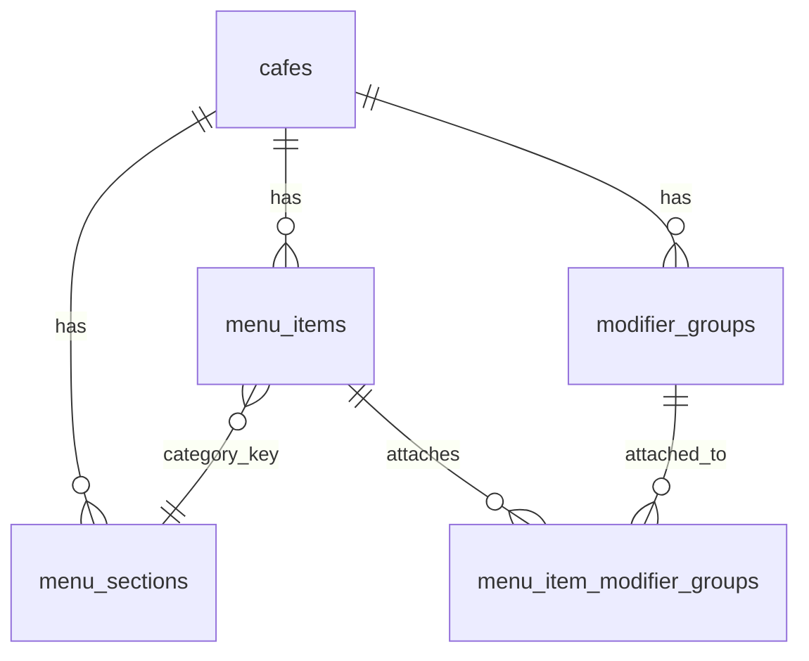

# Menu management

Cafés on the **manual** POS adapter manage their catalogue via the admin dashboard (`MenuManager`). Customer order-ahead reads the same normalised contract from `GET /api/v1/menu`.

## Concepts

| Concept | Purpose |
| -------- | ------- |
| **Menu section** | Café-scoped top-level grouping (`hot_drinks`, `cold_drinks`, `food`, or custom e.g. `ube`) |
| **Menu item** | A product (latte, croissant) with a section `category` key, optional description, base price or sizes |
| **Size** | Per-item absolute prices (S/M/L). Empty `sizes` → single-price item uses `price_minor` |
| **Modifier section** | Café-level reusable library (Milks, Syrups, Toppings) attached per item |
| **KDS metadata** | `colorHex` + `chipLabel` on sizes and options for future colour-coded KDS chips |

Milks and syrups are **not** menu sections — they are modifier library groups attached only where needed.

**Food** is a permanent system section: disabled by default, always visible in admin with “No current food items” until enabled or items are added. Custom sections are created with a simple name field (slugified to a key).

## Data model

- `menu_sections` — café registry (`key`, `label`, `enabled`, `is_system`, `sort_order`)
- `menu_items.category` — section **key** (TEXT)
- `menu_items.sizes` — JSONB array of `NormalisedItemSize`
- `modifier_groups` — café library (`options` JSONB includes `colorHex`, `chipLabel`)
- `menu_item_modifier_groups` — ordered attachment join

Migrations: `012_menu_modifier_library.sql`, `020_menu_sections.sql`

## API (admin JWT + `X-Cafe-Slug`)

| Method | Path | Notes |
| ------ | ---- | ----- |
| GET | `/menu/manage` | Full menu incl. hidden items + `sections` |
| GET | `/menu` | Public catalogue + `sections` |
| POST/PATCH/DELETE | `/menu`, `/menu/:id` | Item CRUD; category must be a café section key |
| GET/POST/PATCH/DELETE | `/menu/sections` | Menu section registry CRUD |
| GET/POST/PATCH/DELETE | `/menu/modifier-groups` | Modifier library CRUD |

Order checkout resolves prices server-side: size absolute base + modifier deltas. Free options use `priceMinor: 0`; customer UI hides `£0.00` tags via `formatPriceTag`.

Loyalty free-drink rewards treat every non-food / non-extras section as a drink (including custom sections).

## Admin UI

Dashboard **Menu & pricing** → tabs:

1. **Items** — menu sections + items; **Add section** (name); Food empty state; create/edit/hide items, sizes, attach modifier groups
2. **Sections (milks, syrups…)** — manage Milks/Syrups/Toppings library with KDS colour + chip label

New cafés receive system menu sections + a starter modifier library (`Milks`, `Syrups`) at signup.

## Future: AI menu scan

Photo upload should output the same draft shape (items, categories, sizes, suggested sections) for human review before publish — reusing this admin UI as the review surface.
