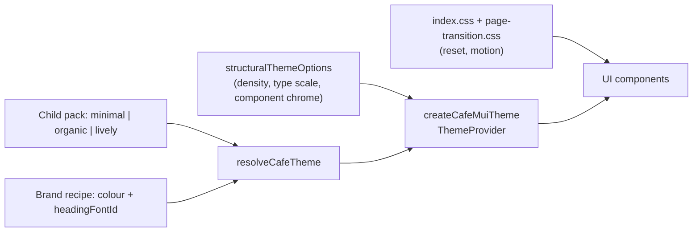

# Order-ahead styling

How visual styles are layered so café themes (and per-café brand colour / heading font) can re-skin the UI without editing page components.

## Layering



1. **Global CSS** — structural reset, motion duration vars, page-route transitions. No brand colours.
2. **`structuralThemeOptions`** (`theme/muiBaseTheme.ts`) — density, typography *scale* (sizes/line-heights only), named radii shell, `components.styleOverrides`. Overrides must use **theme callbacks**, never hex literals. **No palette or font families here.**
3. **Child pack** — one of three `CafeTheme` templates in `@moonshot/domain` (`minimal`, `organic`, `lively`): radii, layout, default fonts, canvas/text/semantics.
4. **Brand recipe** — stored as `theme_overrides.brand: { color?, headingFontId? }`, applied at **resolve** time via `resolveCafeTheme` (not a dump of derived hexes). Brand colour seeds primary + related surfaces; pack keeps page background and primary/muted text. Semantic colours stay pack-fixed. Heading font overlays `headingFamily` for **h1–h6** only; body stays pack `bodyFamily`.
5. **UI** — MUI components + shared `styled(...)` primitives that read `theme.palette` / `theme.typography` / `theme.radii` / `theme.cafeLayout`.

`createCafeMuiTheme(null)` falls back to `resolveCafeTheme('minimal')`. Unknown / legacy theme ids coerce via `coerceBaseThemeId` (`heritage`→`minimal`, `botanical`/`classic`→`organic`, `bold`→`lively`).

## Adding a child theme

1. Add `packages/domain/src/themes/packs/<id>.ts` exporting a full `CafeTheme`.
2. Register in `resolve-cafe-theme.ts` / `BaseThemeId` in `@moonshot/types`.
3. Done — Admin preview, API validation, and order-ahead share the same pack. Contract tests enforce pack shape and that order-ahead has no hex outside theme resolution.

## Where styles belong

| Concern | Where it lives |
|---------|----------------|
| Reset, reduced-motion, page transitions | Global CSS (`index.css`, `page-transition.css`) |
| Type scale, density, component chrome | `structuralThemeOptions` |
| Palette, font families, webfont URLs | Domain packs + `deriveBrandSurfaces` / heading catalog |
| Named radii (`card` / `control` / `pill`) | `@moonshot/domain` `radiiFromCardStyle` → `theme.radii` |
| Elevated secondary card chrome | `theme/surfaceCardChrome.ts` → `MuiPaper` + `SurfaceCard` / `PressableCard` / `LoyaltyCardShell` |
| Reusable custom controls | `styled(...)` under `src/components/ui/` reading `({ theme }) => …` |
| Page layout / one-off spacing | `sx` layout-only (`display`, `gap`, `mt`, flex) |
| Never in components | Hex / raw `rgba(...)` for brand colours; magic `borderRadius: 1.25` |

### Allowed `sx`

```tsx
sx={{ display: 'flex', gap: 1, mt: 2, borderRadius: sxRadius('card') }}
```

### Forbidden for brand

```tsx
sx={{ bgcolor: '#0d1b3d', borderRadius: 1.25 }}
```

Use theme tokens (`'primary.main'`, `'divider'`, `'background.paper'`), `sxRadius(...)`, or a styled primitive instead.

## Theme extension points

- **`palette.cafe.*`** — surfaces and hero (`heroBg`, `heroText`, `textMuted`, …). Prefer these for hero/glass UI; use `alpha(theme.palette.cafe.heroText, …)` when translucency is needed.
- **Surface stack** — page canvas is `colors.background` → `palette.background.default`; elevated cards use `colors.surfaceElevated` → `palette.background.paper`. Mid `colors.surface` / `palette.cafe.surface` sits between them. Keep `surfaceElevated` lighter than the page so cards do not read as border-only.
- **`SurfaceCard`** — shared elevated secondary card. Prefer it over hand-rolled `Box` + `border: 1` for card chrome.
- **`theme.radii`** — `card` (papers/cards), `control` (buttons/chips/tiles), `pill` (fully round). Derived from `layout.cardStyle`. **Never** assign `999` to `shape.borderRadius` (that used to make every Paper a circle under `pill`).
- **`cafeLayout`** — `menuGrid` drives Menu columns; `heroStyle` drives Home hero (`full` / `compact` / `none`); `navStyle` drives App chrome (`bottom_bar` / `top_bar`); `cardStyle` drives radii.
- **Webfonts** — packs declare `typography.webfontUrls`; brand heading font URL is merged at resolve. `CafeProvider` injects `<link data-moonshot-theme-font>` on theme change (no hardcoded fonts in `index.html`).
- **Page column** — `Container maxWidth="sm"` and fixed chrome share `theme/pageLayout.ts`: full-bleed through tablet, then a 600px column from **1024px**. Use `pageContentWidthSx` for nav/cart/snackbar shells.

## Interactive controls

Use real MUI primitives (`Button`, `ButtonBase`, `Chip`, `ToggleButton`) or shared styled wrappers (`OptionTile`, `PressableCard`, `SurfaceCard`) so `theme.components` overrides apply. Do **not** use `Box component="button"` with hand-rolled brand `sx`.

## Hex is allowed only in

- `packages/domain/src/themes/packs/*.ts` (café packs)
- Domain colour derivation helpers (tests / internal)

Not in order-ahead page/component TSX, and **not** in the structural base theme.
