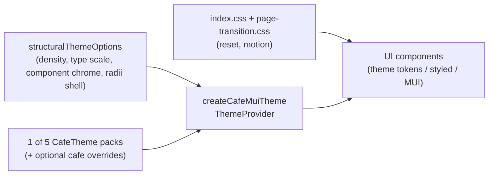

# Order-ahead styling

How visual styles are layered so café themes (and per-café colour/font overrides) can re-skin the UI without editing page components.

## Layering



1. **Global CSS** — structural reset, motion duration vars, page-route transitions. No brand colours.
2. **`structuralThemeOptions`** (`theme/muiBaseTheme.ts`) — density, typography *scale* (sizes/line-heights only), named radii shell, `components.styleOverrides`. Overrides must use **theme callbacks**, never hex literals. **No palette or font families here.**
3. **Café pack + overrides** — one of five `CafeTheme` templates (`heritage`, `botanical`, `minimal`, `bold`, `classic`), optionally deep-merged with café-specific colour/font overrides, mapped via `cafeTokensToMuiOptions`. Packs are the **sole** source of brand colour and font families. `createCafeMuiTheme(null)` falls back to `getTheme('heritage')`.
4. **UI** — MUI components + shared `styled(...)` primitives that read `theme.palette` / `theme.typography` / `theme.radii` / `theme.cafeLayout`.

## Adding a child theme

1. Add `src/themes/<id>.ts` exporting a full `CafeTheme` (every colour, typography including `webfontUrls`, layout enums).
2. Register it in `src/themes/index.ts` and extend `BaseThemeId` in `@moonshot/types`.
3. Done — no component edits. Contract tests in `themes/theme-contract.test.ts` enforce the pack shape and that no hex appears outside theme packs.

## Where styles belong

| Concern | Where it lives |
|---------|----------------|
| Reset, reduced-motion, page transitions | Global CSS (`index.css`, `page-transition.css`) |
| Type scale, density, component chrome | `structuralThemeOptions` |
| Palette, font families, webfont URLs | Café packs only (`src/themes/*.ts`) |
| Named radii (`card` / `control` / `pill`) | `theme/radii.ts` → `theme.radii` (from `cardStyle`) |
| Elevated secondary card chrome | `theme/surfaceCardChrome.ts` → `MuiPaper` + `SurfaceCard` / `PressableCard` / `LoyaltyCardShell` |
| Reusable custom controls | `styled(...)` under `src/components/ui/` reading `({ theme }) => …` |
| Page layout / one-off spacing | `sx` layout-only (`display`, `gap`, `mt`, flex) |
| Never in components | Hex / raw `rgba(...)` for brand colours; magic `borderRadius: 1.25` |

### Allowed `sx`

```tsx
sx={{ display: 'flex', gap: 1, mt: 2, borderRadius: sxRadius('card') }}
```

### Forbidden for brand

```tsx
sx={{ bgcolor: '#0d1b3d', borderRadius: 1.25 }}
```

Use theme tokens (`'primary.main'`, `'divider'`, `'background.paper'`), `sxRadius(...)`, or a styled primitive instead.

## Theme extension points

- **`palette.cafe.*`** — surfaces and hero (`heroBg`, `heroText`, `textMuted`, …). Prefer these for hero/glass UI; use `alpha(theme.palette.cafe.heroText, …)` when translucency is needed.
- **Surface stack** — page canvas is `colors.background` → `palette.background.default`; elevated cards use `colors.surfaceElevated` → `palette.background.paper`. Mid `colors.surface` / `palette.cafe.surface` sits between them. Keep `surfaceElevated` lighter than the page so cards do not read as border-only.
- **`SurfaceCard`** — shared elevated secondary card. Prefer it over hand-rolled `Box` + `border: 1` for card chrome.
- **`theme.radii`** — `card` (papers/cards), `control` (buttons/chips/tiles), `pill` (fully round). Derived from `layout.cardStyle`. **Never** assign `999` to `shape.borderRadius` (that used to make every Paper a circle under `pill`).
- **`cafeLayout`** — `menuGrid` drives Menu columns; `heroStyle` drives Home hero (`full` / `compact` / `none`); `navStyle` drives App chrome (`bottom_bar` / `top_bar`); `cardStyle` drives radii.
- **Webfonts** — packs declare `typography.webfontUrls`; `CafeProvider` injects `<link data-moonshot-theme-font>` on theme change (no hardcoded fonts in `index.html`).
- **Page column** — `Container maxWidth="sm"` and fixed chrome share `theme/pageLayout.ts`: full-bleed through tablet, then a 600px column from **1024px**. Use `pageContentWidthSx` for nav/cart/snackbar shells.

## Interactive controls

Use real MUI primitives (`Button`, `ButtonBase`, `Chip`, `ToggleButton`) or shared styled wrappers (`OptionTile`, `PressableCard`, `SurfaceCard`) so `theme.components` overrides apply. Do **not** use `Box component="button"` with hand-rolled brand `sx`.

## Hex is allowed only in

- `src/themes/*.ts` (café packs)

Not in page/component TSX, and **not** in the structural base theme.
