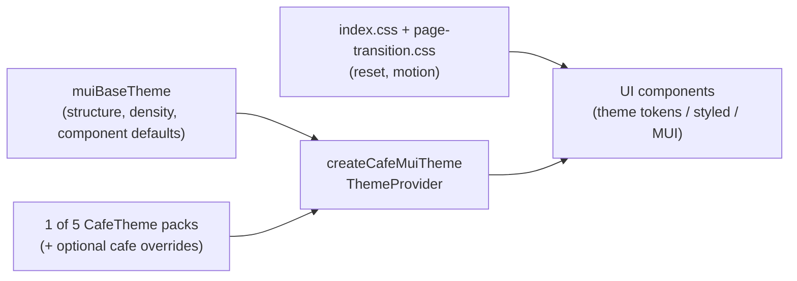

# Order-ahead styling

How visual styles are layered so café themes (and per-café colour/font overrides) can re-skin the UI without editing page components.

## Layering



1. **Global CSS** — structural reset, motion duration vars, page-route transitions. No brand colours.
2. **`muiBaseTheme`** — functional defaults (density, typography scale, `components.styleOverrides`). Overrides must use **theme callbacks**, never hex literals, so café palette merges win.
3. **Café pack + overrides** — one of five `CafeTheme` templates (`heritage`, `botanical`, `minimal`, `bold`, `classic`), optionally deep-merged with café-specific colour/font overrides, mapped via `cafeTokensToMuiOptions`.
4. **UI** — MUI components + shared `styled(...)` primitives that read `theme.palette` / `theme.typography` / `theme.shape`.

## Where styles belong

| Concern | Where it lives |
|---------|----------------|
| Reset, reduced-motion, page transitions | Global CSS (`index.css`, `page-transition.css`) |
| Palette, typography, radius, button/chip/paper defaults | `muiBaseTheme` + café layer |
| Reusable custom controls (option tile, pressable card, qty badge, fixed bars) | `styled(...)` under `src/components/ui/` reading `({ theme }) => …` |
| Page layout / one-off spacing | `sx` layout-only (`display`, `gap`, `mt`, flex, absolute position) |
| Never in components | Hex / raw `rgba(...)` for brand colours |

### Allowed `sx`

```tsx
sx={{ display: 'flex', gap: 1, mt: 2, position: 'relative' }}
```

### Forbidden for brand

```tsx
sx={{ bgcolor: '#0d1b3d', borderRadius: 12 }}
```

Use theme tokens (`'primary.main'`, `'divider'`, `'background.paper'`) or a styled primitive instead.

## Theme extension points

- **`palette.cafe.*`** — surfaces and hero (`heroBg`, `heroText`, `textMuted`, …). Prefer these for hero/glass UI over ad-hoc white overlays; use `alpha(theme.palette.cafe.heroText, …)` when translucency is needed.
- **`cafeLayout`** — layout enums from the café pack (`menuGrid`, `cardStyle`, `heroStyle`, `navStyle`). Prefer reading these when adding layout variants rather than hardcoding per page.
- **Page column** — `Container maxWidth="sm"` and fixed chrome share `theme/pageLayout.ts`: full-bleed through tablet, then a 600px column + expanded gutters from **1024px** (not MUI’s default 600px `sm` media query). Use `pageContentWidthSx` for nav/cart/snackbar shells so they stay aligned.

## Interactive controls

Use real MUI primitives (`Button`, `ButtonBase`, `Chip`, `ToggleButton`) or shared styled wrappers (`OptionTile`, `PressableCard`) so `theme.components` overrides apply. Do **not** use `Box component="button"` with hand-rolled brand `sx`.

## Hex is allowed only in

- `src/themes/*.ts` (café packs)
- `src/theme/muiBaseTheme.ts` **palette** definitions (defaults before café merge)

Not in page/component TSX.
