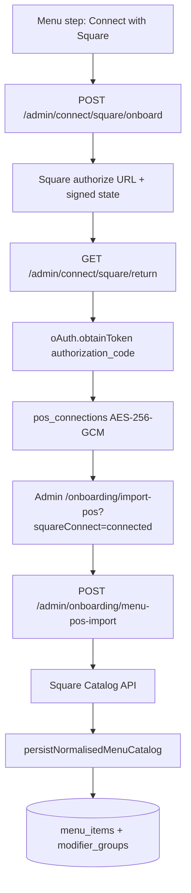

# Square OAuth + Catalog import

Connects a café's Square seller account during admin onboarding and imports the Item Library into Moonshot Postgres. Order webhooks and the scheduled token-refresh job are **follow-ups** (roadmap M3).

## Flow



## Decision record

**Square owns items and modifier lists.** Moonshot layers only Flow prep groups Square cannot express (Shots, Beans, Milk Temperature, Milk Texture, Ice Level, Toppings) via drink-archetype name inference. Square list names are kept as-is; they are appended into `cafes.kds_config.modifierClassification` so the KDS chip taxonomy still resolves.

**Customer menu reads stay on Postgres.** `GET /menu` uses `fetchMenuForCafe` — flipping `pos_provider` to `square` must never turn every customer load into a Square API call. POS adapters are for sync/ingress only.

## API routes

| Method | Route | Auth | Purpose |
|--------|-------|------|---------|
| `POST` | `/admin/connect/square/onboard` | Admin JWT | Returns Square authorize URL |
| `GET` | `/admin/connect/square/return` | Public (signed `state`) | Code exchange + token store + redirect |
| `GET` | `/admin/connect/square/status` | Admin JWT | Connection + locations |
| `POST` | `/admin/connect/square/disconnect` | Admin JWT | Revoke + delete |
| `POST` | `/admin/onboarding/menu-pos-import` | Admin JWT | Catalog → normalise → Postgres |

## Token storage

OAuth tokens live in `pos_connections` (not `cafes.pos_config`):

- Encrypted with AES-256-GCM (`POS_TOKEN_ENCRYPTION_KEY`, base64 32-byte key)
- Format `v1:<iv>:<tag>:<ciphertext>`
- Decrypted only in `pos-connections-repository.ts`
- Unique on `(cafe_id, provider)` and `(provider, merchant_id)` — merchant id is ready for webhook routing

Generate a local key:

```bash
node -e "console.log(require('crypto').randomBytes(32).toString('base64'))"
```

## Env vars (API)

| Variable | Purpose |
|----------|---------|
| `SQUARE_APPLICATION_ID` | Square app client id |
| `SQUARE_APPLICATION_SECRET` | Square app secret |
| `SQUARE_ENVIRONMENT` | `sandbox` (default) or `production` |
| `SQUARE_OAUTH_REDIRECT_URL` | Must match the redirect URL registered in Square Dashboard, e.g. `http://localhost:3000/api/v1/admin/connect/square/return` |
| `SQUARE_CONNECT_ADMIN_REDIRECT_URL` | Where the browser lands after OAuth, e.g. `http://localhost:5174/onboarding/import-pos` |
| `POS_TOKEN_ENCRYPTION_KEY` | Base64 32-byte AES key |

## Sandbox setup

1. Create a Square Developer application (Sandbox).
2. Under **OAuth**, add the redirect URL above.
3. Create a Sandbox seller / Test account and add a few items + modifier lists (Milks / Syrups).
4. Set the env vars, run migrations (`pnpm --filter @moonshot/api migrate`), start the API + admin.
5. Sign up a café → onboarding Menu step → **Connect my menu with Square**.

## Scopes requested

`MERCHANT_PROFILE_READ`, `ITEMS_READ`, plus `ORDERS_READ`, `ORDERS_WRITE`, `PAYMENTS_READ` so the webhook follow-up does not force every café to reconnect.

## Follow-ups (not in this slice)

- **Token refresh job** — access tokens expire in 30 days; `access_token_expires_at` + `status = needs_reauth` are already on the table.
- **App-level webhooks** — route by `merchant_id` via `pos_connections_provider_merchant_unique`.
- **C&B cutover** from any hand-wired legacy token.
