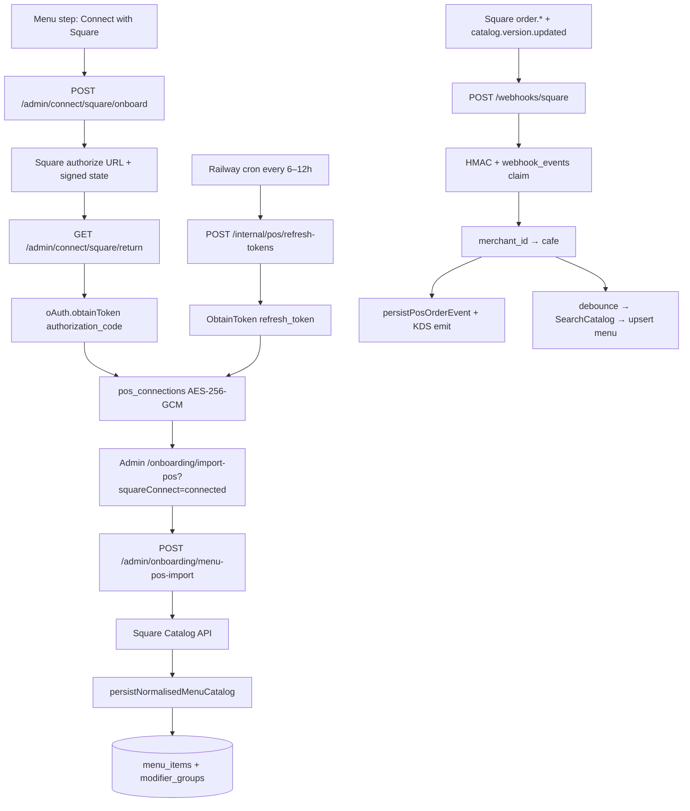

# Square OAuth, token refresh, catalog sync, and order webhooks

Connects a café's Square seller account during admin onboarding, imports the Item Library into Moonshot Postgres, keeps the menu in sync via `catalog.version.updated` + Admin Sync + daily cron, refreshes OAuth tokens on a schedule, and ingests till/POS tickets through an app-level webhook.

Clay & Bean cutover from any hand-wired legacy token remains a separate step (roadmap M3).

## Flow



## Decision record

**Square owns items and modifier lists.** Moonshot layers only Flow prep groups Square cannot express (Shots, Beans, Milk Temperature, Milk Texture, Ice Level, Toppings) via drink-archetype name inference. Square list names are kept as-is; they are appended into `cafes.kds_config.modifierClassification` so the KDS chip taxonomy still resolves.

**Customer menu reads stay on Postgres.** `GET /menu` uses `fetchMenuForCafe` — flipping `pos_provider` to `square` must never turn every customer load into a Square API call. POS adapters are for sync/ingress only.

**App-level webhooks (one URL, one signature key).** Route by `merchant_id` via `pos_connections`. Unknown merchants are ACK'd and ignored to avoid Square retry storms.

## API routes

| Method | Route | Auth | Purpose |
|--------|-------|------|---------|
| `POST` | `/admin/connect/square/onboard` | Admin JWT | Returns Square authorize URL |
| `GET` | `/admin/connect/square/return` | Public (signed `state`) | Code exchange + token store + redirect |
| `GET` | `/admin/connect/square/status` | Admin JWT | Connection + locations |
| `POST` | `/admin/connect/square/disconnect` | Admin JWT | Revoke + delete |
| `POST` | `/admin/onboarding/menu-pos-import` | Admin JWT | Catalog → normalise → Postgres |
| `POST` | `/internal/pos/refresh-tokens` | `CRON_SECRET` | Refresh due Square access tokens |
| `POST` | `/internal/pos/sync-catalogs` | `CRON_SECRET` | Safety-net catalog sync (stale >1 day) |
| `POST` | `/admin/menu/sync-pos` | Admin JWT | Force Square → Moonshot menu sync |
| `POST` | `/webhooks/square` | Square HMAC | Order ingress + catalog sync enqueue |

## Token storage

OAuth tokens live in `pos_connections` (not `cafes.pos_config`):

- Encrypted with AES-256-GCM (`POS_TOKEN_ENCRYPTION_KEY`, base64 32-byte key)
- Format `v1:<iv>:<tag>:<ciphertext>`
- Decrypted only in `pos-connections-repository.ts`
- Unique on `(cafe_id, provider)` and `(provider, merchant_id)` — merchant id routes webhooks

Generate a local key:

```bash
node -e "console.log(require('crypto').randomBytes(32).toString('base64'))"
```

## Token refresh job

Access tokens expire after ~30 days. The refresh job:

1. Selects `pos_connections` where `provider = square`, `status = active`, and (`access_token_expires_at` within 7 days **or** `last_refreshed_at` older than 7 days).
2. Calls Square `ObtainToken(grant_type=refresh_token)`.
3. Upserts ciphertext + `access_token_expires_at` + `last_refreshed_at`.
4. On permanent auth failure (revoked / invalid refresh): sets `status = needs_reauth` (no infinite retry).
5. **Stale-token alert:** loading an active connection whose last refresh is older than ~8 days (or already expired) emits a structured `console.error` with café id + merchant id (never token values).

### Railway cron

Create a Railway cron service (or cron schedule) that hits the production API:

```bash
curl -X POST "https://moonshotapi-production.up.railway.app/api/v1/internal/pos/refresh-tokens" \
  -H "Authorization: Bearer ${CRON_SECRET}"
```

Recommended schedule: every **6–12 hours** (roadmap requires ≤7 days; frequent runs are cheap).

Set the same `CRON_SECRET` on the API service and the cron caller. Optional header alternative: `X-Cron-Secret`.

## Order webhooks

### Dashboard (ops)

1. In Square Developer Dashboard → Webhooks, create **one** app-level subscription.
2. Notification URL: `https://moonshotapi-production.up.railway.app/api/v1/webhooks/square` (must match `SQUARE_WEBHOOK_NOTIFICATION_URL` exactly — trailing slash matters for HMAC).
3. Copy the signature key → `SQUARE_WEBHOOK_SIGNATURE_KEY`.
4. Subscribe at minimum to:
   - `order.created`
   - `order.updated`
   - `order.fulfillment.updated`
   - `catalog.version.updated`

### Catalog sync (Square → Moonshot)

Square is source of truth for items, prices, **category hierarchy**, modifier lists, availability, and **images**. Moonshot Flow prep groups (shots, beans, milk temp/texture, ice, toppings) are **opt-in** via admin drink types — never auto-attached on import/sync.

1. `catalog.version.updated` enqueues a **debounced** (~45s) sync per café.
2. Incremental `SearchCatalogObjects(begin_time=cursor)` (or full List on first sync / Admin force).
3. Normalise to `PosCatalog` (mirrors Square parent/child categories + modifier ordinals) → `upsertPosCatalog`.
4. On success, emit `admin:menu:synced` and `customerMenuUpdated` so Admin / order-ahead soft-reload (no 10s poll).
5. Admin **Sync from Square** calls `POST /admin/menu/sync-pos`.
6. Daily cron: `POST /internal/pos/sync-catalogs` with `CRON_SECRET` (missed webhooks).

Cursor lives on `pos_connections.catalog_sync_cursor` / `catalog_last_synced_at`. See [pos-normalisation.md](./pos-normalisation.md).

### Order runtime

1. Verify `x-square-hmacsha256-signature` over `{notificationUrl}{rawBody}`.
2. Claim `webhook_events` with `provider = square` and Square `event_id` (idempotent).
3. Resolve café via `findCafeIdByMerchantId`.
4. Refresh-on-demand if the access token is near expiry, then `RetrieveOrder`.
5. `persistPosOrderEvent` upserts `orders` with `source = pos` and unique `(cafe_id, pos_order_id)`, then emits `kds:order:new` / `updated` / `removed`.

Canceled Square orders → Moonshot `cancelled` + KDS remove. Mapping of modifiers is best-effort for launch (name/qty/notes); deep chip parity can iterate after C&B cutover.

## Env vars (API)

| Variable | Purpose |
|----------|---------|
| `SQUARE_APPLICATION_ID` | Square app client id |
| `SQUARE_APPLICATION_SECRET` | Square app secret |
| `SQUARE_ENVIRONMENT` | `sandbox` (default) or `production` |
| `SQUARE_OAUTH_REDIRECT_URL` | Must match the redirect URL registered in Square Dashboard |
| `SQUARE_CONNECT_ADMIN_REDIRECT_URL` | Where the browser lands after OAuth |
| `POS_TOKEN_ENCRYPTION_KEY` | Base64 32-byte AES key |
| `CRON_SECRET` | Bearer / `X-Cron-Secret` for `/internal/pos/*` |
| `SQUARE_WEBHOOK_SIGNATURE_KEY` | App-level webhook signature key from Dashboard |
| `SQUARE_WEBHOOK_NOTIFICATION_URL` | Exact notification URL used in HMAC (prod default: Railway API `/api/v1/webhooks/square`) |

## Sandbox setup

1. Create a Square Developer application (Sandbox).
2. Under **OAuth**, add the redirect URL above.
3. Create a Sandbox seller / Test account and add a few items + modifier lists (Milks / Syrups).
4. Set the env vars, run migrations (`pnpm --filter @moonshot/api migrate`), start the API + admin.
5. Sign up a café → onboarding Menu step → **Connect my menu with Square**.
6. (Optional) Point a Sandbox webhook at a tunnel URL and set `SQUARE_WEBHOOK_NOTIFICATION_URL` to that same URL.

## Scopes requested

`MERCHANT_PROFILE_READ`, `ITEMS_READ`, `ORDERS_READ`, `ORDERS_WRITE`, `PAYMENTS_READ`.

## Still open

- **C&B cutover** — retire any hand-wired legacy token / per-location webhook and confirm no duplicate order events before claiming full release DoD.
