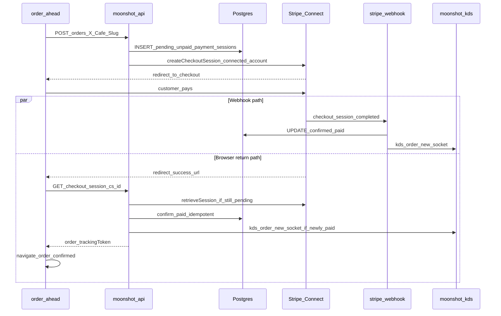

# Stripe checkout return & order recovery

How paid Stripe orders reach the KDS after the customer returns from Checkout, and which env vars / code paths are involved.

## Platform env (API only)

Café owners **do not** configure Stripe return URLs. Ops sets one base URL on **`moonshot-api`**:

```env
# Local
ORDER_AHEAD_BASE_URL=http://localhost:5176

# Production
ORDER_AHEAD_BASE_URL=https://moonshotorder-ahead-production.up.railway.app
```

`checkoutUrlsForCafe(slug)` in `apps/moonshot-api/src/lib/order-checkout-env.ts` builds per-café URLs:

| Purpose | URL pattern |
|---------|-------------|
| Success | `{ORDER_AHEAD_BASE_URL}/{slug}/checkout/restore?checkout_session_id={CHECKOUT_SESSION_ID}` |
| Cancel | `{ORDER_AHEAD_BASE_URL}/{slug}/checkout` |

Legacy **`ORDER_AHEAD_SUCCESS_URL`** / **`ORDER_AHEAD_CANCEL_URL`** still work for single-café setups but break multi-tenant slug routing.

## End-to-end flow



1. **`POST /api/v1/orders`** (stripe mode) creates **`pending` / `unpaid`**, records **`payment_sessions`**, returns **`checkoutUrl`**.
2. Customer pays on Stripe (session on the café's **connected account**).
3. **Confirmation** (either path, idempotent):
   - **`checkout.session.completed`** webhook → `confirmOrderPaidFromStripeCheckout` → **`kds:order:new`** + ETA recompute.
   - **Return URL** → `GET /api/v1/orders/checkout-session/:sessionId` → `recoverOrderFromStripeCheckoutSession` retrieves the session from Stripe when still pending and confirms the same way.
4. Order-ahead **`CheckoutRestore`** confirms the session, **clears the cart** (sessionStorage), then navigates to **`/orders/:id/confirmed`**.

The cart is persisted in **`sessionStorage`** keyed by café slug so a Stripe cancel return to `/checkout` keeps lines; success clears it to avoid duplicate orders.

KDS only lists **`confirmed` / `preparing` / `ready`**. A **`pending`** order visible on Home but missing from KDS means payment was never confirmed.

## Order-ahead routing & `X-Cafe-Slug`

Multi-tenant routes live under **`/:cafeSlug/...`**. `apiFetch` sends **`X-Cafe-Slug`** from a module-level slug set by **`CafeProvider`**.

**Important:** `CheckoutRestore` calls the API in a child `useEffect` on first paint. React runs **child effects before parent effects**, so setting the slug only in `CafeProvider`'s `useEffect` caused the restore request to use the default slug (`clay-and-bean`) → **404 Order not found for this checkout session**.

**Fix:** `CafeProvider` calls `setRuntimeCafeSlug(slug)` **during render** so the slug matches the URL before any child effect runs.

## Local development

| Requirement | Notes |
|-------------|--------|
| `ORDER_AHEAD_BASE_URL` | Must match the order-ahead Vite origin (e.g. `http://localhost:5176`). |
| `STRIPE_API_KEY` + Connect | Café must complete Stripe onboarding (`chargesEnabled`). |
| Webhook (optional) | `stripe listen --forward-to localhost:3000/api/v1/webhooks/stripe` — set `STRIPE_WEBHOOK_SECRET` from CLI output. **Recovery on return confirms paid orders even without a local webhook.** |

## Payment provider auto-switch

New self-service cafés default to **`pay_in_store`**. When admin syncs Stripe status and **`chargesEnabled`** becomes true, `syncAdminStripeAccountStatus` flips **`features.order_ahead.paymentProvider`** to **`stripe`** so checkout uses Stripe without a manual admin toggle.

## Ops: backfill loyalty after swallowed KDS side-effects

If KDS **Done** succeeded but loyalty did not update (missing `cafe_users` row, transient error):

```bash
REPLAY_CAFE_SLUG=bobo REPLAY_ORDER_ID='<uuid>' pnpm --filter @moonshot/api replay:order-loyalty
```

Requires order **`status = completed`** and signed-in **`orders.user_id`**.

## Related code

| Path | Role |
|------|------|
| `apps/moonshot-api/src/lib/orders/checkout-session-recovery.ts` | Return-path confirm + KDS emit |
| `apps/moonshot-api/src/lib/orders/order-checkout.ts` | `payment_sessions`, webhook confirm |
| `apps/moonshot-order-ahead/src/pages/CheckoutRestore.tsx` | Reads `checkout_session_id`; clears cart on success |
| `apps/moonshot-order-ahead/src/lib/cart-storage.ts` | Per-slug sessionStorage cart |
| `apps/moonshot-order-ahead/src/config/CafeProvider.tsx` | Sync slug for `X-Cafe-Slug` |
| `apps/moonshot-api/src/lib/cafe-membership.ts` | `ensureCafeMembership` before orders / loyalty |
| `apps/moonshot-api/src/lib/requested-pickup.ts` | Clamp delay → `requested_pickup_not_before` |

See also [current/http-surface.md](current/http-surface.md), [architecture/realtime.md](architecture/realtime.md), [current/flows.md](current/flows.md).

## Connect onboarding (`POST /admin/payments/stripe/onboarding-link`)

Express connected accounts are **created per café**, not reused. A 500 on this route is not “this Stripe login is already linked.”

Live platforms must complete Stripe’s Connect **platform profile** (loss liability) before `accounts.create` succeeds. Until then the API returns **503** with café-safe copy and logs `[stripe-connect] onboarding_failed` (`kind: platform_profile`) including Stripe’s dashboard URL.

Ops: [Connect platform profile](https://dashboard.stripe.com/settings/connect/platform-profile).
